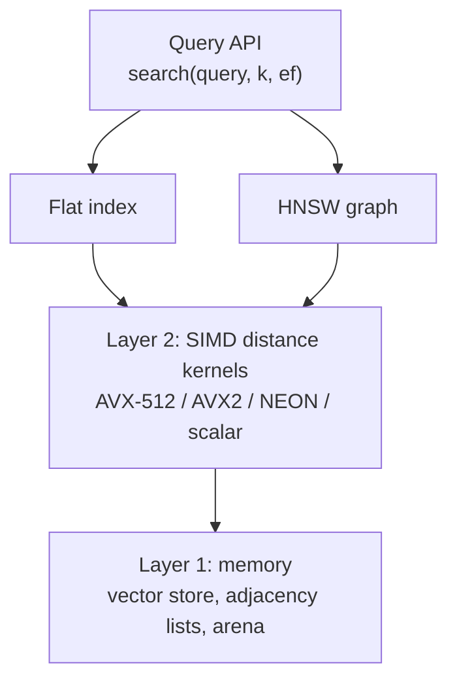
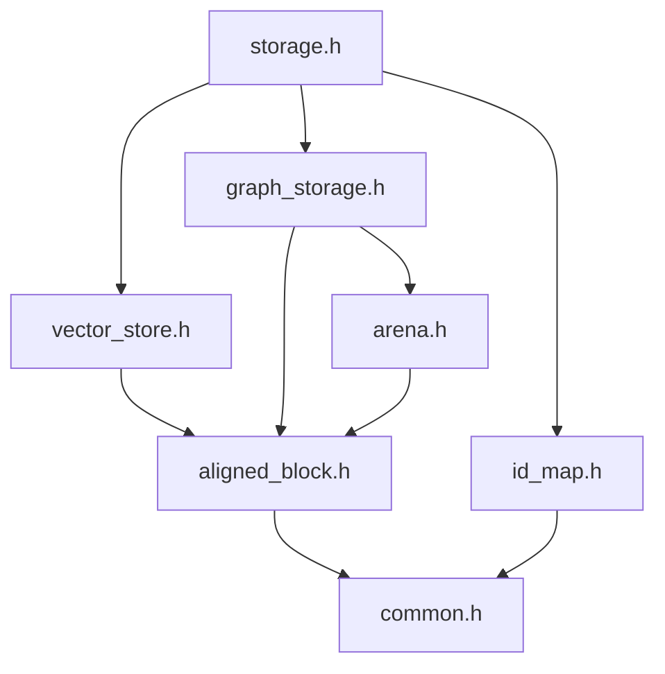
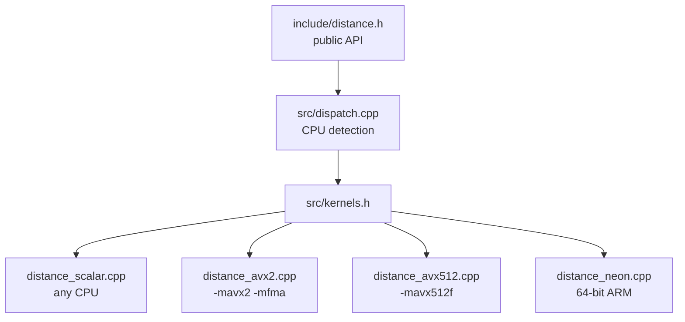

# hnsw-lite

A minimal, in-memory vector search engine written in modern C++20, built from scratch to show how libraries like hnswlib, Faiss, Qdrant and Milvus work under the hood.

The engine stores high-dimensional vectors (embeddings) and will find the nearest neighbors of a query vector using two indexes: an exact brute-force **Flat** index and an approximate **HNSW** (Hierarchical Navigable Small World) graph.

> **Status:** Layer 1 (memory and storage) and Layer 2 (SIMD distance kernels) are complete and tested. Layer 3 (indexes) is next. See the [Roadmap](#roadmap).

---

## Table of contents

- [Why this project](#why-this-project)
- [Features](#features)
- [Architecture](#architecture)
- [Project structure](#project-structure)
- [Requirements](#requirements)
- [Building and running](#building-and-running)
- [Usage example](#usage-example)
- [Layer 1 design: memory and storage](#layer-1-design-memory-and-storage)
- [Layer 2 design: distance kernels](#layer-2-design-distance-kernels)
- [API reference](#api-reference)
- [Testing](#testing)
- [Benchmarks](#benchmarks)
- [Limitations](#limitations)
- [Roadmap](#roadmap)
- [Comparison with existing implementations](#comparison-with-existing-implementations)
- [References](#references)

---

## Why this project

Vector search is the backbone of modern AI infrastructure: retrieval-augmented generation (RAG), semantic search and multimodal retrieval all depend on it. Production vector databases get their speed from low-level C++ work: memory layout, cache efficiency and SIMD math.

hnsw-lite implements that core in a small, readable codebase, with every design decision documented.

## Features

**Layer 1: memory and storage (done)**

- Vectors stored in contiguous, 64-byte-aligned, zero-padded rows.
- Chunked storage: memory is never reallocated or moved, so addresses stay valid.
- Bump-pointer arena allocator: no per-node heap allocations.
- Cache-friendly, fixed-stride HNSW adjacency lists.
- `std::span` views for zero-copy access.
- Mapping between user IDs and dense internal IDs, with tombstone deletion.

**Layer 2: distance kernels (done)**

- Squared L2, inner product and cosine distances.
- Four implementations: scalar, AVX2 + FMA, AVX-512 and NEON.
- Runtime CPU detection: one binary picks the fastest version the machine supports.
- 7x to 12x faster than scalar code on x86 (see [Benchmarks](#benchmarks)).
- Tested on real and emulated x86 CPUs from 2008 onward, and on 64-bit ARM.

**Planned**

- Flat (brute-force) index with top-k selection.
- HNSW index: insertion, neighbor-selection heuristic and layered beam search.
- Recall vs. queries-per-second benchmarks on standard datasets.

## Architecture

The engine is built as four layers. Each layer only depends on the one below it.



| Layer | Purpose | Status |
|---|---|---|
| 1. Memory | Stores vectors and neighbor lists; finds them by arithmetic | Done |
| 2. Distance kernels | Measures how close two vectors are, using SIMD | Done |
| 3. Indexes | Flat (exact) and HNSW (approximate) search | Planned |
| 4. Query API | Public `search(query, k, ef)` interface | Planned |

### Layer 1 file dependencies



### Layer 2 file dependencies



## Project structure

```
hnsw-lite/
├── .gitignore                  # Ignores IDE settings and build output
├── CMakeLists.txt              # Builds the library, tests and benchmark
├── README.md                   # This file
├── include/                    # Public headers (namespace vecdb)
│   ├── common.h                # Layer 1: NodeId, kEmpty, kAlign, round_up
│   ├── aligned_block.h         # Layer 1: AlignedBlock, one aligned memory block
│   ├── arena.h                 # Layer 1: Arena, bump allocator
│   ├── vector_store.h          # Layer 1: VectorStore, aligned padded rows
│   ├── id_map.h                # Layer 1: IdMap, user ID <-> internal ID
│   ├── graph_storage.h         # Layer 1: GraphStorage, HNSW neighbor lists
│   ├── storage.h               # Layer 1: Storage, single entry point
│   └── distance.h              # Layer 2: Metric, get_distance(), normalize()
├── src/                        # Layer 2 implementation
│   ├── kernels.h               # Internal declarations of all kernels
│   ├── dispatch.cpp            # CPU detection, kernel selection, normalize()
│   ├── distance_scalar.cpp     # Plain loops, any CPU (reference version)
│   ├── distance_avx2.cpp       # AVX2 + FMA, 8 floats per instruction
│   ├── distance_avx512.cpp     # AVX-512F, 16 floats per instruction
│   └── distance_neon.cpp       # NEON, 4 floats per instruction (ARM only)
├── tests/
│   ├── test_layer1.cpp         # Tests for Layer 1
│   └── test_distance.cpp       # Tests for Layer 2
└── bench/
    └── bench_distance.cpp      # Speed of every kernel version
```

Layer 1 is header-only. Layer 2 is compiled into a static library (`hnsw_lite`), because each SIMD file needs its own compiler flags.

## Requirements

| Tool | Minimum version |
|---|---|
| C++ standard | C++20 (required for `std::span`) |
| GCC (including MinGW / w64devkit) | 11 |
| Clang | 14 |
| MSVC | Visual Studio 2022 |
| CMake | 3.20 |

Supported CPUs: any x86-64 or 64-bit ARM processor. SIMD versions are used automatically when available.

## Building and running

### CLion

1. Open the `hnsw-lite` folder.
2. Run **Tools → CMake → Reset Cache and Reload Project**.
3. Choose **All CTest** from the run configuration dropdown and click **Run** to run every test.
4. For the benchmark, add a **Release** profile (Settings → Build, Execution, Deployment → CMake), select it, and run `bench_distance`. Debug builds turn off optimizations, so their timings are meaningless.

### Command line: Linux and macOS

```bash
cmake -B build -DCMAKE_BUILD_TYPE=Release
cmake --build build
ctest --test-dir build --output-on-failure
./build/bench_distance
```

### Command line: Windows with GCC (MinGW / w64devkit)

```powershell
cmake -B build -G Ninja -DCMAKE_CXX_COMPILER=g++ -DCMAKE_BUILD_TYPE=Release
cmake --build build
ctest --test-dir build --output-on-failure
.\build\bench_distance.exe
```

### Command line: Windows with MSVC

Open **Developer PowerShell for VS 2022** from the Start menu (a normal PowerShell window does not have MSVC's tools set up), then:

```powershell
cmake -B build -DCMAKE_BUILD_TYPE=Release
cmake --build build --config Release
ctest --test-dir build -C Release --output-on-failure
```

> If you switch compilers, delete the `build` folder first. CMake remembers the compiler it chose there.

### With memory-error checkers (Linux and macOS only)

AddressSanitizer and UndefinedBehaviorSanitizer catch memory bugs such as out-of-bounds writes. They are off by default because MinGW and MSVC do not support them in this setup.

```bash
cmake -B build -DHNSW_LITE_SANITIZE=ON
cmake --build build
ctest --test-dir build --output-on-failure
```

### Using the library in your own project

```cmake
add_subdirectory(hnsw-lite)
target_link_libraries(your_target PRIVATE hnsw_lite)
```

## Usage example

```cpp
#include <cstdio>
#include <vector>

#include "distance.h"
#include "storage.h"

int main() {
    vecdb::Storage db(/*dim=*/4, /*M=*/16);

    std::vector<float> a{0.1f, 0.2f, 0.3f, 0.4f};
    std::vector<float> b{0.5f, 0.6f, 0.7f, 0.8f};

    // Cosine distance needs vectors of length 1, so normalize before storing.
    vecdb::normalize(a);
    vecdb::normalize(b);

    // Layer 1: store the vectors and connect them on level 0.
    vecdb::NodeId ia = db.insert(/*user id=*/1001, a, /*level=*/0);
    vecdb::NodeId ib = db.insert(/*user id=*/1002, b, /*level=*/1);
    db.graph().links(ia, 0)[0] = ib;
    db.graph().links(ib, 0)[0] = ia;

    // Layer 2: get the fastest cosine kernel for this CPU and use it.
    vecdb::DistanceFn cosine = vecdb::get_distance(vecdb::Metric::Cosine);
    const auto& vs = db.vectors();
    float d = cosine(vs.get_padded(ia).data(), vs.get_padded(ib).data(), vs.stride());

    std::printf("kernel in use: %s\n", vecdb::isa_name(vecdb::active_isa()));
    std::printf("cosine distance between %u and %u: %.4f\n", ia, ib, d);
    std::printf("vector %u has %zu neighbor(s)\n", ia,
                vecdb::GraphStorage::count(db.graph().links(ia, 0)));
}
```

Output on a CPU with AVX-512:

```
kernel in use: avx512
cosine distance between 0 and 1: 0.0311
vector 0 has 1 neighbor(s)
```

Note that the kernel is given the **padded** row and the **stride**, not the dimension. For now, levels and neighbors are set by hand; once Layer 3 is built, the HNSW index will choose them automatically.

## Layer 1 design: memory and storage

### Goals

Every design choice in Layer 1 follows three rules:

1. **Find anything by arithmetic.** Converting a vector's number to its memory address is a calculation, never a search.
2. **Never move data.** Once something is stored, its address stays the same, so views (`std::span`) and pointers stay valid.
3. **Match the hardware.** The processor reads memory in 64-byte cache lines, so data is aligned to and packed into whole cache lines.

### Internal IDs

Users identify vectors with their own 64-bit IDs. Internally, each vector gets a dense `NodeId` (a 32-bit unsigned integer) in insertion order: 0, 1, 2, and so on. The same `NodeId` is used as an index into every array: vector rows, neighbor lists, levels and deletion flags. 32-bit IDs also halve the size of neighbor lists compared to 64-bit IDs or pointers.

### Alignment and padding

Each vector row is padded with zeros to a multiple of 16 floats (64 bytes):

| Dimension | Stored size (stride) | Padding |
|---|---|---|
| 100 | 112 floats | 12 zeros |
| 128 | 128 floats | none |
| 384 | 384 floats | none |
| 768 | 768 floats | none |
| 1536 | 1536 floats | none |

Because every memory block starts on a 64-byte boundary and every row is a whole number of cache lines, every row starts on a cache-line boundary. This avoids loads that span two cache lines, and lets the SIMD kernels process whole rows with no leftover elements. Padding is always zero, so it never changes distance results.

### Chunked storage

Rows are stored in fixed-size blocks of `2^shelf_bits` rows (65,536 by default). New blocks are added when needed; existing blocks never move or grow. Finding vector `N`:

```
block   = N >> shelf_bits
row     = N & (2^shelf_bits - 1)
address = block_start + row * stride
```

Neighbor lists on level 0 use the same scheme.

### Arena allocator

Variable-size data (upper-level neighbor lists) comes from a bump allocator. It requests large blocks (1 MB by default) and hands out pieces by advancing a counter. Individual pieces are never freed; everything is freed when the arena is destroyed. This avoids one heap allocation per node and keeps related data close together in memory. Only trivially copyable, trivially destructible types may be stored, which is checked at compile time.

### Graph storage

- **Level 0:** every node has `M0 = 2 * M` slots. With `M = 16`, that is 32 slots × 4 bytes = 128 bytes, exactly two cache lines.
- **Levels 1 and up:** a node at level `L` gets one arena allocation of `L * M` slots. Only about `1 / M` of nodes reach level 1, so most nodes use no extra memory.
- **Empty slots** hold `kEmpty` (the maximum `NodeId`). A list's length is the position of the first `kEmpty`. New level-0 blocks are filled with byte `0xFF`, which makes every slot `kEmpty` with no extra work.

### Memory budget

Approximate memory for 1 million vectors with 768 dimensions and `M = 16`:

| Component | Memory |
|---|---|
| Vectors (768 floats × 4 bytes) | ~3.07 GB |
| Level-0 neighbor lists (128 bytes each) | ~128 MB |
| Upper-level neighbor lists | ~4 MB |
| Levels, deletion flags, ID list | ~10 MB |
| User ID hash map | tens of MB |

The graph is about 4% of the vector data, so it can afford fixed-size slots in exchange for speed.

## Layer 2 design: distance kernels

A single HNSW search computes thousands of distances, and a Flat search computes one per stored vector. Nearly all search time is spent in these kernels.

### Metrics

Every distance follows one rule: **a smaller value means closer**. This keeps the search code independent of the metric.

| Metric | Returns | Notes |
|---|---|---|
| `L2` | Σ (aᵢ − bᵢ)² | No square root: the ranking is the same and it saves work |
| `InnerProduct` | −(a · b) | Negated so that a larger dot product gives a smaller distance |
| `Cosine` | 1 − (a · b) | Vectors must be normalized first with `normalize()` |

Cosine normally needs both vectors' lengths on every call. Instead, vectors are scaled to length 1 once, before they are stored, which turns cosine into a plain dot product. Only two real kernels (L2 and dot product) are therefore needed per instruction set.

### SIMD versions

| Version | Floats per instruction | Main loop | Available on |
|---|---|---|---|
| Scalar | 1 | 1 per step | Every CPU |
| NEON | 4 | 16 per step | 64-bit ARM |
| AVX2 + FMA | 8 | 32 per step | Most x86 CPUs since about 2013 |
| AVX-512F | 16 | 64 per step | Newer Intel server CPUs, AMD Zen 4 and later |

Each SIMD kernel works in three stages:

1. **Main loop** with **4 independent running sums**. A single running sum forces every addition to wait for the previous one; four sums let the CPU work on four additions at once. FMA (fused multiply-add) does each multiply and add in one instruction.
2. **Leftover loop**, one register at a time, for lengths that are not a multiple of the main-loop size.
3. **Final reduction**: the running sums are combined and the values inside the register are added into one number.

Because Layer 1 pads every row to a multiple of 16 floats, no kernel ever needs a scalar tail loop. Kernels use unaligned load instructions, which are as fast as aligned loads on aligned data and never crash on unaligned input.

### Runtime dispatch

All versions are built into one binary, and the fastest usable one is chosen when the program first asks for a kernel:

1. **Compile time:** CMake adds the AVX2 and AVX-512 files only on x86-64, each compiled with only its own flags, and defines `HNSW_LITE_HAVE_AVX2` / `HNSW_LITE_HAVE_AVX512`. On 64-bit ARM it defines `HNSW_LITE_HAVE_NEON`. The NEON file is part of every build but compiles to nothing on x86.
2. **Run time (x86):** `cpuid` reports which instruction sets the CPU supports, and `xgetbv` reports whether the operating system saves the wide registers. Both must agree: a CPU can support AVX-512 while the OS has it disabled.
3. **Choice:** AVX-512, then AVX2, then NEON, then scalar. The result is cached in function-local statics, which C++ initializes exactly once, even with several threads.

### Safety rule for SIMD files

`src/kernels.h` contains declarations only, and kernel files include as little as possible. If a file compiled with `-mavx2` included a header with inline functions, the compiler could build those functions with AVX2 instructions, and the linker could then use that copy everywhere, crashing on CPUs without AVX2.

### Input rules

Every `DistanceFn` expects:

- `n` to be a multiple of 16 (pass `VectorStore::stride()`, not `dim()`);
- values beyond the real dimension to be zero (`VectorStore` guarantees this).

Queries from users are not padded, so Layer 3 will copy each query into a padded, aligned buffer once per search.

## API reference

All code is in the `vecdb` namespace. Invalid input throws `std::invalid_argument`, `std::out_of_range` or `std::length_error`.

### `common.h`

| Name | Description |
|---|---|
| `NodeId` | Internal vector number (`std::uint32_t`) |
| `kEmpty` | Largest `NodeId`; marks an empty neighbor slot |
| `kAlign` | Alignment in bytes (64) |
| `kFloatsPerLine` | Floats per cache line (16) |
| `round_up(n, m)` | Rounds `n` up to a multiple of `m` |

### `AlignedBlock`

| Member | Description |
|---|---|
| `AlignedBlock(bytes, fill = 0)` | Allocates `bytes` (rounded up to 64), 64-byte aligned, filled with `fill` |
| `data()` | Start address |
| `size()` | Size in bytes |

Not copyable, movable. Frees its memory in the destructor.

### `Arena`

| Member | Description |
|---|---|
| `Arena(block_bytes = 1 MB)` | Creates an empty arena |
| `allocate(bytes, align)` | Returns `bytes` of memory aligned to `align` (power of two, at most 64) |
| `allocate_array<T>(n)` | Returns memory for `n` objects of plain type `T` |
| `block_count()` | Number of blocks allocated so far |

### `VectorStore`

| Member | Description |
|---|---|
| `VectorStore(dim, shelf_bits = 16)` | Creates a store for vectors of `dim` floats |
| `add(span<const float>)` | Copies a vector in, returns its `NodeId` |
| `get(id)` | Read-only `span` of `dim` floats (no copy) |
| `get_padded(id)` | Read-only `span` of `stride` floats, including padding |
| `size()`, `dim()`, `stride()` | Number of vectors, dimension, padded row length |

### `IdMap`

| Member | Description |
|---|---|
| `add(external)` | Registers a user ID, returns the next `NodeId`; throws on duplicates |
| `find(external)` | `std::optional<NodeId>` for a user ID |
| `external(id)` | User ID of a `NodeId` |
| `mark_deleted(id)`, `is_deleted(id)` | Sets or checks the deletion flag |
| `size()` | Number of registered IDs |

### `GraphStorage`

| Member | Description |
|---|---|
| `GraphStorage(M = 16, shelf_bits = 16)` | Creates storage with `M` links per upper level and `2M` on level 0 |
| `add_node(level)` | Adds the next node with the given top level (0 to 255), returns its `NodeId` |
| `links(id, level)` | Writable `span` of the node's slots on that level; throws if the node does not reach it |
| `count(slots)` | Number of used slots (static) |
| `level(id)` | Top level of a node |
| `size()`, `M()`, `M0()` | Number of nodes and list capacities |

### `Storage`

| Member | Description |
|---|---|
| `Storage(dim, M = 16)` | Creates all Layer 1 parts |
| `insert(external, vector, level)` | Validates input, then adds the vector to `IdMap`, `VectorStore` and `GraphStorage`; returns its `NodeId` |
| `vectors()`, `graph()`, `ids()` | Access to the parts |
| `size()` | Number of stored vectors |

### `distance.h`

| Name | Description |
|---|---|
| `enum class Metric { L2, InnerProduct, Cosine }` | Which distance to compute |
| `enum class Isa { Scalar, Avx2, Avx512, Neon }` | Which instruction set a kernel uses |
| `DistanceFn` | `float (*)(const float* a, const float* b, std::size_t n)` |
| `get_distance(metric)` | Fastest kernel for this CPU; never `nullptr` |
| `get_distance(metric, isa)` | A specific version, or `nullptr` if this build or CPU cannot run it |
| `isa_supported(isa)` | True if `isa` is compiled in and this CPU can run it |
| `active_isa()` | The version `get_distance(metric)` uses |
| `isa_name(isa)` | `"scalar"`, `"avx2"`, `"avx512"` or `"neon"` |
| `normalize(span<float>)` | Scales a vector to length 1 in place; a zero vector is left unchanged |

## Testing

Both test programs are registered with CTest and run together as one suite:

```
1/2 Test #1: test_layer1 ......   Passed
2/2 Test #2: test_distance ....   Passed
100% tests passed, 0 tests failed out of 2
```

**`tests/test_layer1.cpp`** checks that:

- Memory blocks start on 64-byte boundaries and start as zero.
- Arena pieces are aligned, do not overlap, and oversized requests work.
- Vectors read back correctly, every row is aligned and padding stays zero.
- Vector addresses never change after new blocks are added.
- User IDs translate both ways, duplicates are rejected and deletion flags work.
- New neighbor lists are empty, links can be written and read, and levels are enforced.
- A rejected insert leaves the storage unchanged.

**`tests/test_distance.cpp`** checks that:

- Every version the CPU supports matches a double-precision reference on random vectors of 9 lengths (16 to 1536), chosen to exercise both the main and leftover loops. Unsupported versions are skipped and reported.
- Exact cases hold: `[1, 2]` vs. `[4, 6]` gives L2 = 25 and inner product distance = −16; identical vectors give L2 = 0; parallel and perpendicular unit vectors give cosine distance 0 and 1.
- Zero padding from `VectorStore` does not change results.
- `normalize()` gives length 1 and leaves a zero vector unchanged.
- Dispatch always returns a usable kernel, and `nullptr` exactly for unsupported versions.

Results differ slightly between versions because SIMD adds numbers in a different order, so comparisons allow a small rounding tolerance scaled to the size of the values.

**CPUs tested:**

| CPU | Versions tested | Version chosen |
|---|---|---|
| Modern x86-64 with AVX-512 | scalar, AVX2, AVX-512 | AVX-512 |
| Emulated Intel Haswell (2013) | scalar, AVX2 | AVX2 |
| Emulated Intel Nehalem (2008) | scalar | scalar |
| Emulated 64-bit ARM | scalar, NEON | NEON |

## Benchmarks

`bench/bench_distance.cpp` measures nanoseconds per squared-L2 call for each supported version. The vectors fit in the CPU cache, so this measures the math itself rather than memory speed. Build in Release mode before running it.

Example results on an x86-64 machine with AVX-512 (your numbers will differ):

| Dimension | Scalar | AVX2 | AVX-512 |
|---|---|---|---|
| 128 | 54.8 ns | 8.0 ns (6.8x) | 6.9 ns (7.9x) |
| 768 | 446.6 ns | 48.5 ns (9.2x) | 36.3 ns (12.3x) |
| 1536 | 905.4 ns | 102.1 ns (8.9x) | 72.7 ns (12.5x) |

The speedups come from two sources: wider instructions, and the 4 independent running sums, which the scalar loop cannot use because the compiler is not allowed to reorder float additions on its own.

## Limitations

These are deliberate for the current stage:

- **Not thread-safe for writes.** Concurrent inserts will need per-node locks and an atomic arena. Reading and kernel dispatch are already safe from several threads.
- **No persistence.** Data lives only in memory. The arena stores raw pointers; switching to offsets will make saving to disk straightforward.
- **No memory reclamation.** Deleted vectors are only flagged; their memory is recovered only by rebuilding.
- **User IDs are 64-bit integers only.**
- **Kernels compare one pair of vectors at a time.** Batched query-vs-many kernels and matrix-multiplication-based flat search are possible future optimizations.
- **On some older Intel CPUs, heavy AVX-512 use lowers the clock speed.** If the AVX2 version benchmarks faster on your machine, that is why.

## Roadmap

- [x] **Layer 1:** aligned vector store, arena allocator, graph storage, ID mapping, tests
- [x] **Layer 2:** SIMD distance kernels (scalar, AVX2, AVX-512, NEON), runtime dispatch, tests, benchmark
- [ ] **Layer 3a:** Flat index with top-k heap, used as ground truth
- [ ] **Layer 3b:** HNSW index: random levels, insertion, neighbor heuristic, beam search, visited lists
- [ ] **Layer 4:** public search API
- [ ] Benchmarks on SIFT1M and GloVe (recall@10 vs. queries per second)
- [ ] Thread-safe insertion
- [ ] Persistence to disk

## Comparison with existing implementations

| | hnsw-lite | hnswlib | Faiss | Qdrant | Milvus |
|---|---|---|---|---|---|
| Language | C++20 | C++11 | C++ (Python bindings) | Rust | Go and C++ |
| Scope | Learning-focused engine | HNSW library | Vector search library | Vector database | Distributed vector database |
| Vector layout | Separate aligned rows | Interleaved with level-0 links | Separate flat storage | Segments, memory-mapped | Via its Knowhere engine |
| Upper-level links | One arena allocation per node | One `malloc` per node | One shared array with offsets | Own implementation | Via Knowhere |
| SIMD selection | Runtime CPU detection | Compile-time flags with runtime checks | Separate builds per instruction set | Runtime CPU detection | Via Knowhere |
| Quantization | No | No | Yes (PQ, SQ, IVF) | Yes | Yes |
| Filtering, persistence, distribution | No | Limited | Limited | Yes | Yes |

hnsw-lite focuses on the in-memory core that these systems share, and leaves out the database features built around it.

## References

- Yu. A. Malkov and D. A. Yashunin, *Efficient and robust approximate nearest neighbor search using Hierarchical Navigable Small World graphs*, arXiv:1603.09320.
- [hnswlib](https://github.com/nmslib/hnswlib)
- [Faiss](https://github.com/facebookresearch/faiss)
- [Qdrant](https://github.com/qdrant/qdrant)
- [Milvus](https://github.com/milvus-io/milvus)
- [ANN-Benchmarks](https://github.com/erikbern/ann-benchmarks)

## License

Not yet chosen. Add a `LICENSE` file (for example MIT or Apache-2.0) before publishing.