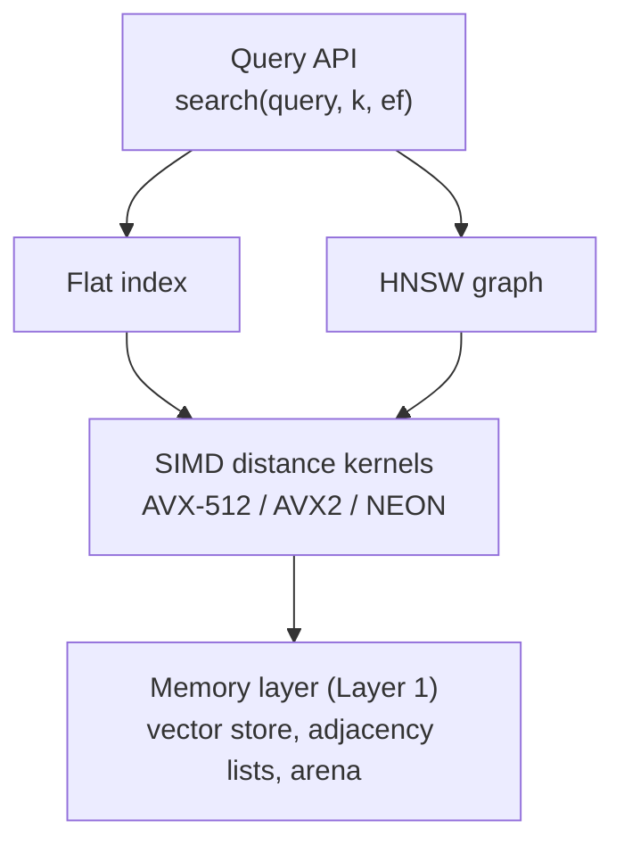
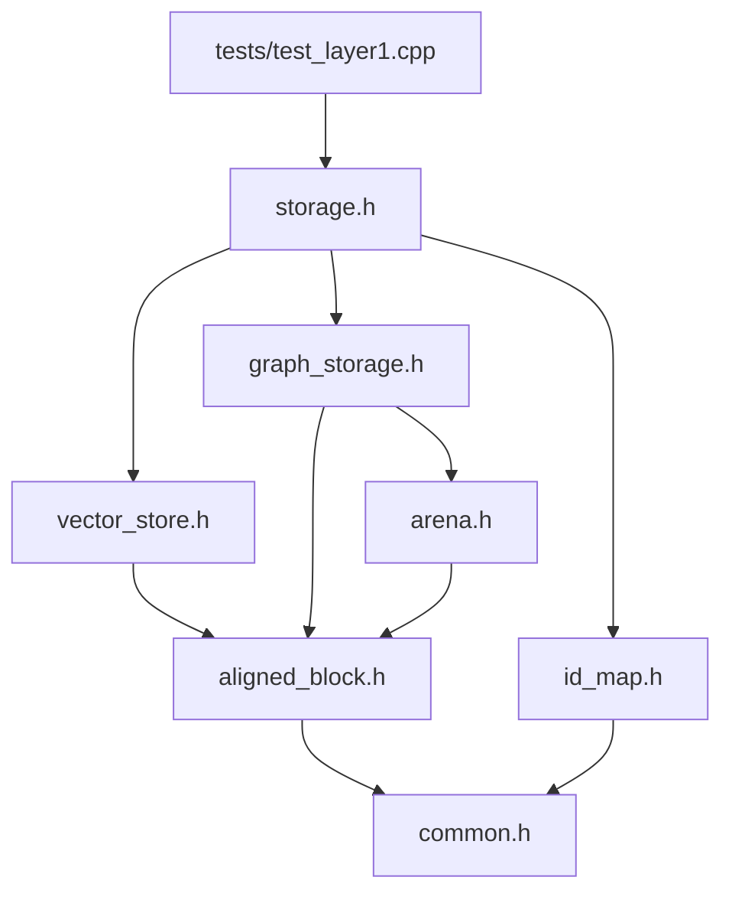

# hnsw-lite

A minimal, in-memory vector search engine written in modern C++20, built from scratch to show how libraries like hnswlib, Faiss, Qdrant and Milvus work under the hood.

The engine stores high-dimensional vectors (embeddings) and will find the nearest neighbors of a query vector using two indexes: an exact brute-force **Flat** index and an approximate **HNSW** (Hierarchical Navigable Small World) graph.

> **Status:** Layer 1 (memory and storage) is complete and tested. Layers 2 and 3 are in progress. See the [Roadmap](#roadmap).

---

## Table of contents

- [Why this project](#why-this-project)
- [Features](#features)
- [Architecture](#architecture)
- [Project structure](#project-structure)
- [Requirements](#requirements)
- [Building and running](#building-and-running)
- [Usage example](#usage-example)
- [Layer 1 design](#layer-1-design)
- [API reference](#api-reference)
- [Testing](#testing)
- [Limitations](#limitations)
- [Roadmap](#roadmap)
- [Comparison with existing implementations](#comparison-with-existing-implementations)
- [References](#references)

---

## Why this project

Vector search is the backbone of modern AI infrastructure: retrieval-augmented generation (RAG), semantic search and multimodal retrieval all depend on it. Production vector databases get their speed from low-level C++ work: memory layout, cache efficiency and SIMD math.

hnsw-lite implements that core in a small, readable codebase, with every design decision documented.

## Features

**Done (Layer 1)**

- Header-only C++20 library, no dependencies.
- Vectors stored in contiguous, 64-byte-aligned, zero-padded rows.
- Chunked storage: memory is never reallocated or moved, so addresses stay valid.
- Bump-pointer arena allocator: no per-node heap allocations.
- Cache-friendly, fixed-stride HNSW adjacency lists.
- `std::span` views for zero-copy access.
- Mapping between user IDs and dense internal IDs, with tombstone deletion.
- Full test suite.

**Planned**

- SIMD distance kernels (L2, inner product, cosine) for AVX2, AVX-512 and NEON, with runtime CPU dispatch.
- Flat (brute-force) index with top-k selection.
- HNSW index: insertion, neighbor-selection heuristic and layered beam search.
- Benchmarks (recall vs. queries per second) on standard datasets.

## Architecture

The engine is built as four layers. Each layer only depends on the one below it.



| Layer | Purpose | Status |
|---|---|---|
| 1. Memory | Stores vectors and neighbor lists; finds them by arithmetic | Done |
| 2. Distance kernels | Measures how close two vectors are, using SIMD | Planned |
| 3. Indexes | Flat (exact) and HNSW (approximate) search | Planned |
| 4. Query API | Public `search(query, k, ef)` interface | Planned |

### Layer 1 file dependencies



## Project structure

```
hnsw-lite/
├── .gitignore              # Ignores IDE settings and build output
├── CMakeLists.txt          # Build configuration (C++20, tests, optional sanitizers)
├── README.md               # This file
├── include/                # Header-only library (namespace vecdb)
│   ├── common.h            # Shared types and constants: NodeId, kEmpty, kAlign, round_up
│   ├── aligned_block.h     # AlignedBlock: owns one 64-byte-aligned, filled memory block
│   ├── arena.h             # Arena: bump allocator for small, never-freed pieces
│   ├── vector_store.h      # VectorStore: aligned, padded rows of vectors in fixed blocks
│   ├── id_map.h            # IdMap: user ID <-> internal ID, deletion flags
│   ├── graph_storage.h     # GraphStorage: HNSW neighbor lists for every level
│   └── storage.h           # Storage: single entry point, keeps the parts in sync
└── tests/
    └── test_layer1.cpp     # Tests for every Layer 1 class
```

All code lives in the `vecdb` namespace.

## Requirements

| Tool | Minimum version |
|---|---|
| C++ standard | C++20 (required for `std::span`) |
| GCC | 11 |
| Clang | 14 |
| MSVC | Visual Studio 2022 |
| CMake | 3.20 |

## Building and running

### CLion

1. Open the `hnsw-lite` folder.
2. Right-click `CMakeLists.txt` and choose **Reload CMake Project**.
3. Select the `test_layer1` configuration and click **Run**.

You should see:

```
All Layer 1 tests passed.
```

### Command line (Linux, macOS, Windows)

```bash
cmake -B build
cmake --build build
ctest --test-dir build --output-on-failure
```

### With memory-error checkers (Linux and macOS only)

AddressSanitizer and UndefinedBehaviorSanitizer catch memory bugs such as out-of-bounds writes. They are off by default because MinGW on Windows does not support them.

```bash
cmake -B build -DHNSW_LITE_SANITIZE=ON
cmake --build build
ctest --test-dir build --output-on-failure
```

### Without CMake

```bash
g++ -std=c++20 -Wall -Wextra -Iinclude tests/test_layer1.cpp -o test_layer1
./test_layer1
```

### Using the library in your own project

The library is header-only. Add the `include/` folder to your include path, or with CMake:

```cmake
add_subdirectory(hnsw-lite)
target_link_libraries(your_target PRIVATE hnsw_lite)
```

## Usage example

```cpp
#include <cstdio>
#include <vector>
#include "storage.h"

int main() {
    vecdb::Storage db(/*dim=*/4, /*M=*/16);

    std::vector<float> a{0.1f, 0.2f, 0.3f, 0.4f};
    std::vector<float> b{0.5f, 0.6f, 0.7f, 0.8f};

    vecdb::NodeId ia = db.insert(/*user id=*/1001, a, /*level=*/0);
    vecdb::NodeId ib = db.insert(/*user id=*/1002, b, /*level=*/1);

    // Connect the two vectors on level 0.
    db.graph().links(ia, 0)[0] = ib;
    db.graph().links(ib, 0)[0] = ia;

    auto v = db.vectors().get(ib);  // std::span<const float>, no copy
    std::printf("vector %u starts with %.1f (dim %zu)\n", ib, v[0], v.size());
    std::printf("vector %u has %zu neighbor(s)\n", ia,
                vecdb::GraphStorage::count(db.graph().links(ia, 0)));
    std::printf("vector %u has user id %llu\n", ib,
                static_cast<unsigned long long>(db.ids().external(ib)));
}
```

Output:

```
vector 1 starts with 0.5 (dim 4)
vector 0 has 1 neighbor(s)
vector 1 has user id 1002
```

For now, the level and the neighbors are set by hand. Once Layer 3 is built, the HNSW index will choose them automatically.

## Layer 1 design

### Goals

Every design choice in Layer 1 follows three rules:

1. **Find anything by arithmetic.** Converting a vector's number to its memory address is a calculation, never a search.
2. **Never move data.** Once something is stored, its address stays the same, so views (`std::span`) and pointers stay valid.
3. **Match the hardware.** The processor reads memory in 64-byte cache lines, so data is aligned to and packed into whole cache lines.

### Internal IDs

Users identify vectors with their own 64-bit IDs. Internally, each vector gets a dense `NodeId` (a 32-bit unsigned integer) in insertion order: 0, 1, 2, and so on. The same `NodeId` is used as an index into every array: vector rows, neighbor lists, levels and deletion flags. 32-bit IDs also halve the size of neighbor lists compared to 64-bit IDs or pointers.

### Alignment and padding

Each vector row is padded with zeros to a multiple of 16 floats (64 bytes):

| Dimension | Stored size (stride) | Padding |
|---|---|---|
| 100 | 112 floats | 12 zeros |
| 128 | 128 floats | none |
| 384 | 384 floats | none |
| 768 | 768 floats | none |
| 1536 | 1536 floats | none |

Because every memory block starts on a 64-byte boundary and every row is a whole number of cache lines, every row starts on a cache-line boundary. This avoids loads that span two cache lines, and lets future SIMD code process whole rows without special handling for leftover elements. Padding is always zero, so it never changes distance results.

### Chunked storage

Rows are stored in fixed-size blocks of `2^shelf_bits` rows (65,536 by default). New blocks are added when needed; existing blocks never move or grow. Finding vector `N`:

```
block   = N >> shelf_bits
row     = N & (2^shelf_bits - 1)
address = block_start + row * stride
```

Neighbor lists on level 0 use the same scheme.

### Arena allocator

Variable-size data (upper-level neighbor lists) comes from a bump allocator. It requests large blocks (1 MB by default) and hands out pieces by advancing a counter. Individual pieces are never freed; everything is freed when the arena is destroyed. This avoids one heap allocation per node and keeps related data close together in memory. Only trivially copyable, trivially destructible types may be stored, which is checked at compile time.

### Graph storage

- **Level 0:** every node has `M0 = 2 * M` slots. With `M = 16`, that is 32 slots × 4 bytes = 128 bytes, exactly two cache lines.
- **Levels 1 and up:** a node at level `L` gets one arena allocation of `L * M` slots. Only about `1 / M` of nodes reach level 1, so most nodes use no extra memory.
- **Empty slots** hold `kEmpty` (the maximum `NodeId`). A list's length is the position of the first `kEmpty`. New level-0 blocks are filled with byte `0xFF`, which makes every slot `kEmpty` with no extra work.

### Memory budget

Approximate memory for 1 million vectors with 768 dimensions and `M = 16`:

| Component | Memory |
|---|---|
| Vectors (768 floats × 4 bytes) | ~3.07 GB |
| Level-0 neighbor lists (128 bytes each) | ~128 MB |
| Upper-level neighbor lists | ~4 MB |
| Levels, deletion flags, ID list | ~10 MB |
| User ID hash map | tens of MB |

The graph is about 4% of the vector data, so it can afford fixed-size slots in exchange for speed.

## API reference

All classes are in the `vecdb` namespace. Invalid input throws `std::invalid_argument`, `std::out_of_range` or `std::length_error`.

### `common.h`

| Name | Description |
|---|---|
| `NodeId` | Internal vector number (`std::uint32_t`) |
| `kEmpty` | Largest `NodeId`; marks an empty neighbor slot |
| `kAlign` | Alignment in bytes (64) |
| `kFloatsPerLine` | Floats per cache line (16) |
| `round_up(n, m)` | Rounds `n` up to a multiple of `m` |

### `AlignedBlock`

| Member | Description |
|---|---|
| `AlignedBlock(bytes, fill = 0)` | Allocates `bytes` (rounded up to 64), 64-byte aligned, filled with `fill` |
| `data()` | Start address |
| `size()` | Size in bytes |

Not copyable, movable. Frees its memory in the destructor.

### `Arena`

| Member | Description |
|---|---|
| `Arena(block_bytes = 1 MB)` | Creates an empty arena |
| `allocate(bytes, align)` | Returns `bytes` of memory aligned to `align` (power of two, at most 64) |
| `allocate_array<T>(n)` | Returns memory for `n` objects of plain type `T` |
| `block_count()` | Number of blocks allocated so far |

### `VectorStore`

| Member | Description |
|---|---|
| `VectorStore(dim, shelf_bits = 16)` | Creates a store for vectors of `dim` floats |
| `add(span<const float>)` | Copies a vector in, returns its `NodeId` |
| `get(id)` | Read-only `span` of `dim` floats (no copy) |
| `get_padded(id)` | Read-only `span` of `stride` floats, including padding |
| `size()`, `dim()`, `stride()` | Number of vectors, dimension, padded row length |

### `IdMap`

| Member | Description |
|---|---|
| `add(external)` | Registers a user ID, returns the next `NodeId`; throws on duplicates |
| `find(external)` | `std::optional<NodeId>` for a user ID |
| `external(id)` | User ID of a `NodeId` |
| `mark_deleted(id)`, `is_deleted(id)` | Sets or checks the deletion flag |
| `size()` | Number of registered IDs |

### `GraphStorage`

| Member | Description |
|---|---|
| `GraphStorage(M = 16, shelf_bits = 16)` | Creates storage with `M` links per upper level and `2M` on level 0 |
| `add_node(level)` | Adds the next node with the given top level (0 to 255), returns its `NodeId` |
| `links(id, level)` | Writable `span` of the node's slots on that level; throws if the node does not reach it |
| `count(slots)` | Number of used slots (static) |
| `level(id)` | Top level of a node |
| `size()`, `M()`, `M0()` | Number of nodes and list capacities |

### `Storage`

| Member | Description |
|---|---|
| `Storage(dim, M = 16)` | Creates all Layer 1 parts |
| `insert(external, vector, level)` | Validates input, then adds the vector to `IdMap`, `VectorStore` and `GraphStorage`; returns its `NodeId` |
| `vectors()`, `graph()`, `ids()` | Access to the parts |
| `size()` | Number of stored vectors |

## Testing

`tests/test_layer1.cpp` checks that:

- Memory blocks start on 64-byte boundaries and start as zero.
- Arena pieces are aligned, do not overlap, and oversized requests work.
- Vectors read back correctly, every row is aligned and padding stays zero.
- Vector addresses never change after new blocks are added.
- User IDs translate both ways, duplicates are rejected and deletion flags work.
- New neighbor lists are empty, links can be written and read, and levels are enforced.
- A rejected insert leaves the storage unchanged.

Small block sizes are used in the tests so that spilling into new blocks is exercised with only a few vectors.

## Limitations

These are deliberate for the current stage:

- **Not thread-safe.** Concurrent inserts will need per-node locks and an atomic arena.
- **No persistence.** Data lives only in memory. The arena stores raw pointers; switching to offsets will make saving to disk straightforward.
- **No memory reclamation.** Deleted vectors are only flagged; their memory is recovered only by rebuilding.
- **User IDs are 64-bit integers only.**

## Roadmap

- [x] **Layer 1:** aligned vector store, arena allocator, graph storage, ID mapping, tests
- [ ] **Layer 2:** SIMD distance kernels (scalar, AVX2, AVX-512, NEON) with runtime dispatch
- [ ] **Layer 3a:** Flat index with top-k heap, used as ground truth
- [ ] **Layer 3b:** HNSW index: random levels, insertion, neighbor heuristic, beam search, visited lists
- [ ] **Layer 4:** public search API
- [ ] Benchmarks on SIFT1M and GloVe (recall@10 vs. queries per second)
- [ ] Thread-safe insertion
- [ ] Persistence to disk

## Comparison with existing implementations

| | hnsw-lite | hnswlib | Faiss | Qdrant | Milvus |
|---|---|---|---|---|---|
| Language | C++20 | C++11 | C++ (Python bindings) | Rust | Go and C++ |
| Scope | Learning-focused engine | HNSW library | Vector search library | Vector database | Distributed vector database |
| Vector layout | Separate aligned rows | Interleaved with level-0 links | Separate flat storage | Segments, memory-mapped | Via its Knowhere engine |
| Upper-level links | One arena allocation per node | One `malloc` per node | One shared array with offsets | Own implementation | Via Knowhere |
| Quantization | No | No | Yes (PQ, SQ, IVF) | Yes | Yes |
| Filtering, persistence, distribution | No | Limited | Limited | Yes | Yes |

hnsw-lite focuses on the in-memory core that these systems share, and leaves out the database features built around it.

## References

- Yu. A. Malkov and D. A. Yashunin, *Efficient and robust approximate nearest neighbor search using Hierarchical Navigable Small World graphs*, arXiv:1603.09320.
- [hnswlib](https://github.com/nmslib/hnswlib)
- [Faiss](https://github.com/facebookresearch/faiss)
- [Qdrant](https://github.com/qdrant/qdrant)
- [Milvus](https://github.com/milvus-io/milvus)
- [ANN-Benchmarks](https://github.com/erikbern/ann-benchmarks)

## License

Not yet chosen. Add a `LICENSE` file (for example MIT or Apache-2.0) before publishing.