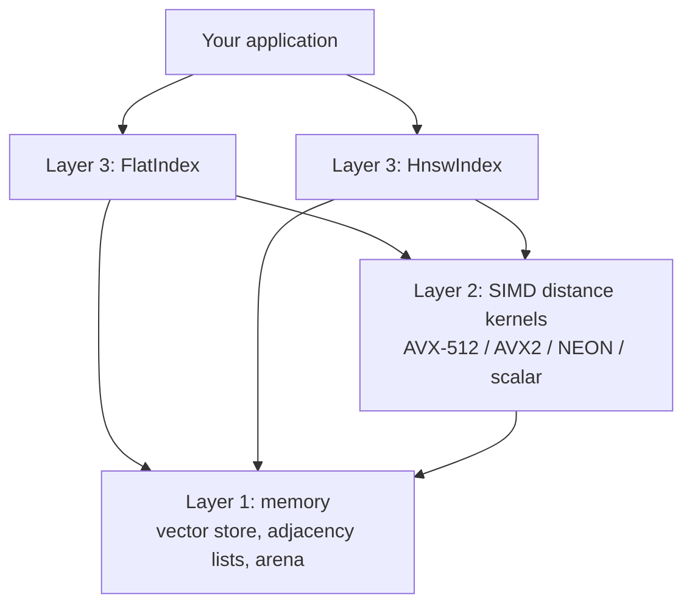
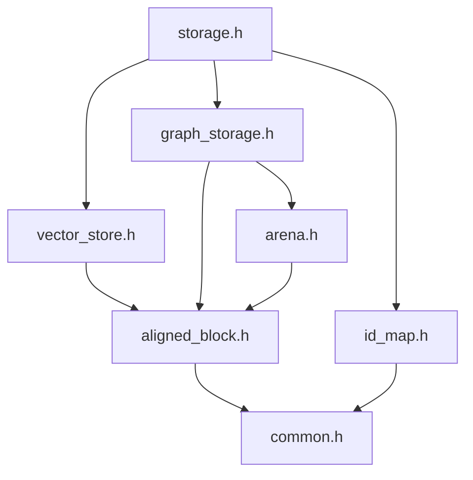
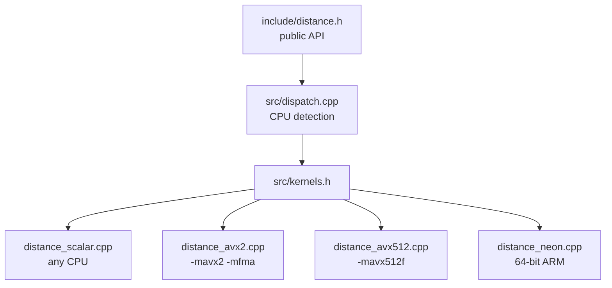
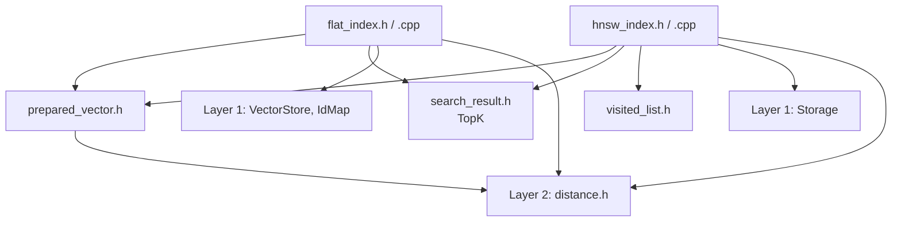

# hnsw-lite

A minimal, in-memory vector search engine written in modern C++20, built from scratch to show how libraries like hnswlib, Faiss, Qdrant and Milvus work under the hood.

The engine stores high-dimensional vectors (embeddings) and finds the nearest neighbors of a query vector using two indexes: an exact brute-force **Flat** index and an approximate **HNSW** (Hierarchical Navigable Small World) graph.

> **Status:** Layers 1 to 3 are complete and tested: memory and storage, SIMD distance kernels, and the Flat and HNSW indexes. On 50,000 vectors, HNSW answers queries about 14x faster than exact search at 99.8% recall. See the [Roadmap](#roadmap).

---

## Table of contents

- [Why this project](#why-this-project)
- [Features](#features)
- [Architecture](#architecture)
- [Project structure](#project-structure)
- [Requirements](#requirements)
- [Building and running](#building-and-running)
- [Usage example](#usage-example)
- [Layer 1 design: memory and storage](#layer-1-design-memory-and-storage)
- [Layer 2 design: distance kernels](#layer-2-design-distance-kernels)
- [Layer 3 design: indexes](#layer-3-design-indexes)
- [API reference](#api-reference)
- [Testing](#testing)
- [Benchmarks](#benchmarks)
- [Limitations](#limitations)
- [Roadmap](#roadmap)
- [Comparison with existing implementations](#comparison-with-existing-implementations)
- [References](#references)

---

## Why this project

Vector search is the backbone of modern AI infrastructure: retrieval-augmented generation (RAG), semantic search and multimodal retrieval all depend on it. Production vector databases get their speed from low-level C++ work: memory layout, cache efficiency and SIMD math.

hnsw-lite implements that core in a small, readable codebase, with every design decision documented.

## Features

**Layer 1: memory and storage (done)**

- Vectors stored in contiguous, 64-byte-aligned, zero-padded rows.
- Chunked storage: memory is never reallocated or moved, so addresses stay valid.
- Bump-pointer arena allocator: no per-node heap allocations.
- Cache-friendly, fixed-stride HNSW adjacency lists.
- `std::span` views for zero-copy access.
- Mapping between user IDs and dense internal IDs, with tombstone deletion.

**Layer 2: distance kernels (done)**

- Squared L2, inner product and cosine distances.
- Four implementations: scalar, AVX2 + FMA, AVX-512 and NEON.
- Runtime CPU detection: one binary picks the fastest version the machine supports.
- 7x to 12x faster than scalar code on x86 (see [Benchmarks](#benchmarks)).
- Tested on real and emulated x86 CPUs from 2008 onward, and on 64-bit ARM.

**Layer 3: indexes (done)**

- `FlatIndex`: exact search over every vector; the ground truth for measuring recall.
- `HnswIndex`: multi-level graph with random levels, greedy descent, beam search on level 0, and the HNSW neighbor-selection heuristic.
- Add, remove (tombstones) and search on both, with results in the user's own IDs.
- Automatic cosine normalization for inserts and queries.
- Invalid input (wrong dimension, NaN, infinity, duplicate IDs) is rejected with `std::invalid_argument` and leaves the index unchanged.
- Robust to exact duplicate vectors: copies cannot crowd unrelated vectors out of the graph.
- Reproducible graphs: the same seed and inserts always build the same graph, on every compiler.
- Concurrent searches are safe when no writer is active (thread-safe visited-list pool).
- Recall@10 of 0.998 or higher in tests, on every CPU type; inner-product recall matches the reference hnswlib on identical data.

**Planned**

- Recall vs. queries-per-second benchmarks on standard datasets (SIFT1M, GloVe).
- Thread-safe insertion and persistence to disk.

## Architecture

The engine is built as three layers. Each layer only depends on the ones below it.



| Layer | Purpose | Status |
|---|---|---|
| 1. Memory | Stores vectors and neighbor lists; finds them by arithmetic | Done |
| 2. Distance kernels | Measures how close two vectors are, using SIMD | Done |
| 3. Indexes | Flat (exact) and HNSW (approximate) search | Done |

### Layer 1 file dependencies



### Layer 2 file dependencies



### Layer 3 file dependencies



## Project structure

```
hnsw-lite/
├── .gitignore                  # Ignores IDE settings and build output
├── CMakeLists.txt              # Builds the library, tests and benchmark
├── README.md                   # This file
├── include/                    # Public headers (namespace vecdb)
│   ├── common.h                # Layer 1: NodeId, kEmpty, kAlign, round_up
│   ├── aligned_block.h         # Layer 1: AlignedBlock, one aligned memory block
│   ├── arena.h                 # Layer 1: Arena, bump allocator
│   ├── vector_store.h          # Layer 1: VectorStore, aligned padded rows
│   ├── id_map.h                # Layer 1: IdMap, user ID <-> internal ID
│   ├── graph_storage.h         # Layer 1: GraphStorage, HNSW neighbor lists
│   ├── storage.h               # Layer 1: Storage, single entry point
│   ├── distance.h              # Layer 2: Metric, get_distance(), normalize()
│   ├── search_result.h         # Layer 3: SearchResult, Candidate, TopK
│   ├── prepared_vector.h       # Layer 3: PreparedVector, padded/normalized input
│   ├── visited_list.h          # Layer 3: VisitedList, VisitedListPool
│   ├── flat_index.h            # Layer 3: FlatIndex
│   └── hnsw_index.h            # Layer 3: HnswIndex, HnswParams
├── src/                        # Compiled code (Layers 2 and 3)
│   ├── kernels.h               # Internal declarations of all kernels
│   ├── dispatch.cpp            # CPU detection, kernel selection, normalize()
│   ├── distance_scalar.cpp     # Plain loops, any CPU (reference version)
│   ├── distance_avx2.cpp       # AVX2 + FMA, 8 floats per instruction
│   ├── distance_avx512.cpp     # AVX-512F, 16 floats per instruction
│   ├── distance_neon.cpp       # NEON, 4 floats per instruction (ARM only)
│   ├── flat_index.cpp          # FlatIndex implementation
│   └── hnsw_index.cpp          # HnswIndex implementation
├── tests/
│   └── test_comprehensive.cpp  # All 216 tests with a built-in runner
└── bench/
    ├── bench_distance.cpp      # Speed of every kernel version
    └── bench_search.cpp        # Flat vs. HNSW: queries/s and recall
```

Layer 1 and the Layer 3 helpers are header-only. Layer 2's kernels and Layer 3's indexes are compiled into a static library (`hnsw_lite`); the SIMD files need their own compiler flags, and the indexes contain real logic.

## Requirements

| Tool | Minimum version |
|---|---|
| C++ standard | C++20 (required for `std::span`) |
| GCC (including MinGW / w64devkit) | 11 |
| Clang | 14 |
| MSVC | Visual Studio 2022 |
| CMake | 3.20 |

Supported CPUs: any x86-64 or 64-bit ARM processor. SIMD versions are used automatically when available.

## Building and running

### CLion

1. Open the `hnsw-lite` folder.
2. Run **Tools → CMake → Reset Cache and Reload Project**.
3. Choose **All CTest** from the run configuration dropdown and click **Run** to run every test.
4. For the benchmarks, add a **Release** profile (Settings → Build, Execution, Deployment → CMake), select it, and run `bench_distance` or `bench_search`. Debug builds turn off optimizations, so their timings are meaningless (and the test suite takes about a minute instead of 4 seconds).

### Command line: Linux and macOS

```bash
cmake -B build -DCMAKE_BUILD_TYPE=Release
cmake --build build
ctest --test-dir build --output-on-failure
./build/bench_distance
./build/bench_search
```

### Command line: Windows with GCC (MinGW / w64devkit)

```powershell
cmake -B build -G Ninja -DCMAKE_CXX_COMPILER=g++ -DCMAKE_BUILD_TYPE=Release
cmake --build build
ctest --test-dir build --output-on-failure
.\build\bench_distance.exe
.\build\bench_search.exe
```

### Command line: Windows with MSVC

Open **Developer PowerShell for VS 2022** from the Start menu (a normal PowerShell window does not have MSVC's tools set up), then:

```powershell
cmake -B build -DCMAKE_BUILD_TYPE=Release
cmake --build build --config Release
ctest --test-dir build -C Release --output-on-failure
```

> If you switch compilers, delete the `build` folder first. CMake remembers the compiler it chose there.

### With memory-error checkers (Linux and macOS only)

AddressSanitizer and UndefinedBehaviorSanitizer catch memory bugs such as out-of-bounds writes. They are off by default because MinGW and MSVC do not support them in this setup.

```bash
cmake -B build -DHNSW_LITE_SANITIZE=ON
cmake --build build
ctest --test-dir build --output-on-failure
```

### Using the library in your own project

```cmake
add_subdirectory(hnsw-lite)
target_link_libraries(your_target PRIVATE hnsw_lite)
```

## Usage example

```cpp
#include <cstdio>
#include <vector>

#include "flat_index.h"
#include "hnsw_index.h"

int main() {
    const std::size_t dim = 4;
    vecdb::HnswIndex index(dim, vecdb::Metric::Cosine);  // M = 16, ef_construction = 200
    vecdb::FlatIndex exact(dim, vecdb::Metric::Cosine);

    std::vector<std::vector<float>> docs = {
        {0.9f, 0.1f, 0.0f, 0.0f},
        {0.8f, 0.2f, 0.1f, 0.0f},
        {0.0f, 0.1f, 0.9f, 0.2f},
        {0.1f, 0.0f, 0.8f, 0.3f},
    };
    for (std::size_t i = 0; i < docs.size(); ++i) {
        index.add(/*user id=*/100 + i, docs[i]);  // vectors are normalized automatically
        exact.add(100 + i, docs[i]);
    }

    std::vector<float> query{1.0f, 0.15f, 0.05f, 0.0f};
    for (const auto& r : index.search(query, /*k=*/2, /*ef=*/64))
        std::printf("hnsw : id %llu, distance %.4f\n", (unsigned long long)r.id, r.distance);
    for (const auto& r : exact.search(query, /*k=*/2))
        std::printf("exact: id %llu, distance %.4f\n", (unsigned long long)r.id, r.distance);

    index.remove(100);
    std::printf("after removing 100, closest is %llu\n",
                (unsigned long long)index.search(query, 1)[0].id);
}
```

Output:

```
hnsw : id 100, distance 0.0020
hnsw : id 101, distance 0.0071
exact: id 100, distance 0.0020
exact: id 101, distance 0.0071
after removing 100, closest is 101
```

Both indexes take plain, unpadded vectors and return the user's own IDs, closest first. Padding, alignment, normalization and kernel selection all happen inside. The lower layers can still be used directly: `Storage`, `VectorStore` and `get_distance()` are public.

## Layer 1 design: memory and storage

### Goals

Every design choice in Layer 1 follows three rules:

1. **Find anything by arithmetic.** Converting a vector's number to its memory address is a calculation, never a search.
2. **Never move data.** Once something is stored, its address stays the same, so views (`std::span`) and pointers stay valid.
3. **Match the hardware.** The processor reads memory in 64-byte cache lines, so data is aligned to and packed into whole cache lines.

### Internal IDs

Users identify vectors with their own 64-bit IDs. Internally, each vector gets a dense `NodeId` (a 32-bit unsigned integer) in insertion order: 0, 1, 2, and so on. The same `NodeId` is used as an index into every array: vector rows, neighbor lists, levels and deletion flags. 32-bit IDs also halve the size of neighbor lists compared to 64-bit IDs or pointers.

### Alignment and padding

Each vector row is padded with zeros to a multiple of 16 floats (64 bytes):

| Dimension | Stored size (stride) | Padding |
|---|---|---|
| 100 | 112 floats | 12 zeros |
| 128 | 128 floats | none |
| 384 | 384 floats | none |
| 768 | 768 floats | none |
| 1536 | 1536 floats | none |

Because every memory block starts on a 64-byte boundary and every row is a whole number of cache lines, every row starts on a cache-line boundary. This avoids loads that span two cache lines, and lets the SIMD kernels process whole rows with no leftover elements. Padding is always zero, so it never changes distance results.

### Chunked storage

Rows are stored in fixed-size blocks of `2^shelf_bits` rows. By default a block holds up to 65,536 rows but at most 8 MB (for example, 16,384 rows at 128 dimensions and 1,024 rows at 1,536 dimensions), so small indexes of long vectors stay small. New blocks are added when needed; existing blocks never move or grow. Finding vector `N`:

```
block   = N >> shelf_bits
row     = N & (2^shelf_bits - 1)
address = block_start + row * stride
```

Neighbor lists on level 0 use the same scheme.

### Arena allocator

Variable-size data (upper-level neighbor lists) comes from a bump allocator. It requests large blocks (1 MB by default) and hands out pieces by advancing a counter. Individual pieces are never freed; everything is freed when the arena is destroyed. This avoids one heap allocation per node and keeps related data close together in memory. Only trivially copyable, trivially destructible types may be stored, which is checked at compile time.

### Graph storage

- **Level 0:** every node has `M0 = 2 * M` slots. With `M = 16`, that is 32 slots × 4 bytes = 128 bytes, exactly two cache lines.
- **Levels 1 and up:** a node at level `L` gets one arena allocation of `L * M` slots. Only about `1 / M` of nodes reach level 1, so most nodes use no extra memory.
- **Empty slots** hold `kEmpty` (the maximum `NodeId`). A list's length is the position of the first `kEmpty`. New level-0 blocks are filled with byte `0xFF`, which makes every slot `kEmpty` with no extra work.

### Memory budget

Approximate memory for 1 million vectors with 768 dimensions and `M = 16`:

| Component | Memory |
|---|---|
| Vectors (768 floats × 4 bytes) | ~3.07 GB |
| Level-0 neighbor lists (128 bytes each) | ~128 MB |
| Upper-level neighbor lists | ~4 MB |
| Levels, deletion flags, ID list | ~10 MB |
| User ID hash map | tens of MB |

The graph is about 4% of the vector data, so it can afford fixed-size slots in exchange for speed.

## Layer 2 design: distance kernels

A single HNSW search computes thousands of distances, and a Flat search computes one per stored vector. Nearly all search time is spent in these kernels.

### Metrics

Every distance follows one rule: **a smaller value means closer**. This keeps the search code independent of the metric.

| Metric | Returns | Notes |
|---|---|---|
| `L2` | Σ (aᵢ − bᵢ)² | No square root: the ranking is the same and it saves work |
| `InnerProduct` | −(a · b) | Negated so that a larger dot product gives a smaller distance |
| `Cosine` | 1 − (a · b) | Vectors must be normalized first with `normalize()` |

Cosine normally needs both vectors' lengths on every call. Instead, vectors are scaled to length 1 once, before they are stored, which turns cosine into a plain dot product. Only two real kernels (L2 and dot product) are therefore needed per instruction set.

### SIMD versions

| Version | Floats per instruction | Main loop | Available on |
|---|---|---|---|
| Scalar | 1 | 1 per step | Every CPU |
| NEON | 4 | 16 per step | 64-bit ARM |
| AVX2 + FMA | 8 | 32 per step | Most x86 CPUs since about 2013 |
| AVX-512F | 16 | 64 per step | Newer Intel server CPUs, AMD Zen 4 and later |

Each SIMD kernel works in three stages:

1. **Main loop** with **4 independent running sums**. A single running sum forces every addition to wait for the previous one; four sums let the CPU work on four additions at once. FMA (fused multiply-add) does each multiply and add in one instruction.
2. **Leftover loop**, one register at a time, for lengths that are not a multiple of the main-loop size.
3. **Final reduction**: the running sums are combined and the values inside the register are added into one number.

Because Layer 1 pads every row to a multiple of 16 floats, no kernel ever needs a scalar tail loop. Kernels use unaligned load instructions, which are as fast as aligned loads on aligned data and never crash on unaligned input.

### Runtime dispatch

All versions are built into one binary, and the fastest usable one is chosen when the program first asks for a kernel:

1. **Compile time:** CMake adds the AVX2 and AVX-512 files only on x86-64, each compiled with only its own flags, and defines `HNSW_LITE_HAVE_AVX2` / `HNSW_LITE_HAVE_AVX512`. On 64-bit ARM it defines `HNSW_LITE_HAVE_NEON`. The NEON file is part of every build but compiles to nothing on x86.
2. **Run time (x86):** `cpuid` reports which instruction sets the CPU supports, and `xgetbv` reports whether the operating system saves the wide registers. Both must agree: a CPU can support AVX-512 while the OS has it disabled.
3. **Choice:** AVX-512, then AVX2, then NEON, then scalar. The result is cached in function-local statics, which C++ initializes exactly once, even with several threads.

### Safety rule for SIMD files

`src/kernels.h` contains declarations only, and kernel files include as little as possible. If a file compiled with `-mavx2` included a header with inline functions, the compiler could build those functions with AVX2 instructions, and the linker could then use that copy everywhere, crashing on CPUs without AVX2.

### Input rules

Every `DistanceFn` expects:

- `n` to be a multiple of 16 (pass `VectorStore::stride()`, not `dim()`);
- values beyond the real dimension to be zero (`VectorStore` guarantees this).

Vectors from users are not padded, so Layer 3's `PreparedVector` copies each query (and each new vector) into a padded, aligned buffer first.

## Layer 3 design: indexes

Layer 3 decides **which** vectors to compare and in what order. It never manages memory (Layer 1) or computes distances itself (Layer 2).

### Components

| Component | Responsibility | Uses from Layer 1 | Uses from Layer 2 |
|---|---|---|---|
| `PreparedVector` | Copies a user vector into a padded, aligned buffer; normalizes it for cosine | `AlignedBlock`, `round_up` | `normalize`, `Metric` |
| `TopK`, `Candidate`, `SearchResult` | Keeps the k best candidates in a bounded max-heap | `NodeId` | none |
| `VisitedList`, `VisitedListPool` | Marks visited nodes in O(1); reuses lists across searches | `NodeId` | none |
| `FlatIndex` | Exact search over every vector | `VectorStore`, `IdMap` | `get_distance`, `DistanceFn` |
| `HnswIndex` | Approximate search over a multi-level graph | `Storage` (all three parts), `kEmpty` | `get_distance`, `DistanceFn` |

`FlatIndex` uses `VectorStore` and `IdMap` directly instead of `Storage`, so it does not pay for 128 bytes of unused neighbor slots per vector. `HnswIndex` uses `Storage`, whose `insert(id, vector, level)` keeps a vector, its neighbor lists and its user ID under the same number.

Only one change was needed in the lower layers: `GraphStorage::set_links`, which replaces a node's neighbor list and clears the leftover slots.

### Shared rules

- **Internal numbers inside, user IDs at the edges.** Every loop works with `NodeId`s, which index Layer 1's arrays directly. User IDs are translated only when an add or remove arrives and when results are returned.
- **Kernel chosen once.** Each index stores its `DistanceFn` when it is created, so search loops make direct calls.
- **One preparation path.** Inserts and queries both go through `PreparedVector`, so cosine normalization cannot be forgotten in one of them.
- **Tombstone removal.** `remove()` only sets the `IdMap` flag. Flat skips flagged vectors; HNSW still travels through them but never returns them.
- **Errors leave the index unchanged.** A wrong dimension, a NaN or infinite value, or a duplicate ID throws `std::invalid_argument` before anything is modified (and, in HNSW, before a random level is drawn, so later inserts build exactly the same graph). IDs cannot be reused, even after removal.
- **Only finite values.** `PreparedVector` rejects NaN and infinity, because one such value would corrupt every distance computed against that vector. Layer 1 itself stores any float.
- **Inserts survive running out of memory.** `IdMap`, `VectorStore`, `GraphStorage`, `Storage` and `FlatIndex` inserts are all-or-nothing: they grow their containers before changing anything, and `Storage` undoes earlier steps if a later one fails. An HNSW insert that fails while linking marks its half-linked vector as removed, so the index stays consistent; that vector's ID stays taken.
- **NaN distances sort last.** Inputs are finite, but an inner product of huge values can still overflow to NaN; `ordered_distance` turns it into +∞.
- **Oversized requests are capped.** A `k` larger than the index returns everything; HNSW's `ef` is raised to at least `k` and capped at the number of nodes.

### FlatIndex

- **add:** prepare the vector, register the ID in `IdMap`, store the values in `VectorStore`.
- **search:** prepare the query; for every vector, skip it if removed, otherwise compute the distance and offer it to a `TopK` of size k; return the sorted results with user IDs.

Cost: one distance per stored vector. Exact, with equal distances ordered by insertion.

### HnswIndex

**Structure.** Every vector is a node on level 0 with up to `2M` links. A node's top level is drawn at random as `floor(-ln(u) / ln(M))`, so about 1 in M nodes reach level 1, 1 in M² reach level 2, and so on. The entry point is a node on the highest level. The random numbers are converted to doubles by hand rather than with `std::uniform_real_distribution`, so graphs are identical across compilers.

**Search** (`search(query, k, ef)`):

1. Prepare the query. Raise `ef` to at least `k`.
2. **Greedy descent:** from the entry point, on each level from the top down to 1, keep moving to any neighbor that is closer to the query.
3. **Beam search on level 0:** a min-heap of candidates to expand and a `TopK` of the best `ef` results. Repeatedly expand the closest candidate; stop when it is farther than the worst result. A borrowed `VisitedList` prevents checking a node twice.
4. Return the best k, skipping removed nodes, with user IDs.

**Insert** (`add(id, vector)`):

1. Validate and prepare the vector; reject duplicates before drawing a random level.
2. Draw the level and store everything with `Storage::insert`. The first node becomes the entry point.
3. Greedy descent from the entry point down to the level just above the new node's level.
4. On each level from the new node's level (or the current top, if lower) down to 0: beam search with `ef_construction`, choose up to M neighbors with the heuristic, and link both ways. The best nodes found become the starting points for the next level. Removed nodes are traveled through but not chosen as neighbors, so new nodes do not waste link slots on them; only if every nearby node is removed does the new node link to them, so it can never end up unreachable.
5. If the new node is higher than every other node, it becomes the entry point.

**Neighbor heuristic.** Candidates are considered closest first; one is kept only if it is closer to the base node than to every neighbor already kept. This keeps links pointing in different directions instead of into one cluster, which keeps the graph navigable. When a neighbor's list is full, the heuristic re-selects that list from its old links plus the new node. These choices match hnswlib.

One addition beyond hnswlib: a candidate that is a **bit-identical copy** of an already-kept neighbor is skipped. Identical vectors are all at distance 0 from each other, a tie, so the plain rule keeps every copy, and lists near a cluster of duplicates fill up with copies of one point. In testing with 200 identical vectors among 200 random ones, this cut links to the rest of the graph and made 44 of the random vectors unreachable; with the copy check, every random vector stays reachable. The check uses `memcmp`, which stops at the first differing byte, so it costs almost nothing, and on data without duplicates the graph is unchanged.

**Threading.** One writer at a time, with no searches running. Several searches may run at once when no writer is active; each borrows its own `VisitedList` from a mutex-protected pool, and returns it automatically through an RAII handle.

## API reference

All code is in the `vecdb` namespace. Invalid input throws `std::invalid_argument`, `std::out_of_range` or `std::length_error`.

### `common.h`

| Name | Description |
|---|---|
| `NodeId` | Internal vector number (`std::uint32_t`) |
| `kEmpty` | Largest `NodeId`; marks an empty neighbor slot |
| `kAlign` | Alignment in bytes (64) |
| `kFloatsPerLine` | Floats per cache line (16) |
| `round_up(n, m)` | Rounds `n` up to a multiple of `m` |

### `AlignedBlock`

| Member | Description |
|---|---|
| `AlignedBlock(bytes, fill = 0)` | Allocates `bytes` (rounded up to 64), 64-byte aligned, filled with `fill` |
| `data()` | Start address |
| `size()` | Size in bytes |

Not copyable, movable. Frees its memory in the destructor.

### `Arena`

| Member | Description |
|---|---|
| `Arena(block_bytes = 1 MB)` | Creates an empty arena |
| `allocate(bytes, align)` | Returns `bytes` of memory aligned to `align` (power of two, at most 64) |
| `allocate_array<T>(n)` | Returns memory for `n` objects of plain type `T` |
| `block_count()` | Number of blocks allocated so far |

### `VectorStore`

| Member | Description |
|---|---|
| `VectorStore(dim, shelf_bits = auto)` | Creates a store for vectors of `dim` floats; blocks default to at most 65,536 rows and 8 MB |
| `add(span<const float>)` | Copies a vector in, returns its `NodeId` |
| `get(id)` | Read-only `span` of `dim` floats (no copy) |
| `get_padded(id)` | Read-only `span` of `stride` floats, including padding |
| `size()`, `dim()`, `stride()` | Number of vectors, dimension, padded row length |
| `rows_per_shelf()` | Rows per memory block |
| `undo_last_add()` | Undoes the most recent `add`; used to roll back a failed insert |

### `IdMap`

| Member | Description |
|---|---|
| `add(external)` | Registers a user ID, returns the next `NodeId`; throws on duplicates |
| `find(external)` | `std::optional<NodeId>` for a user ID |
| `external(id)` | User ID of a `NodeId` |
| `mark_deleted(id)`, `is_deleted(id)` | Sets or checks the deletion flag |
| `undo_last_add(external)` | Undoes the most recent `add`; used to roll back a failed insert |
| `size()` | Number of registered IDs |

### `GraphStorage`

| Member | Description |
|---|---|
| `GraphStorage(M = 16, shelf_bits = 16)` | Creates storage with `M` links per upper level and `2M` on level 0 |
| `add_node(level)` | Adds the next node with the given top level (0 to 255), returns its `NodeId` |
| `links(id, level)` | Writable `span` of the node's slots on that level; throws if the node does not reach it |
| `count(slots)` | Number of used slots (static) |
| `set_links(id, level, neighbors)` | Replaces the node's list on that level and marks the remaining slots empty |
| `undo_last_add()` | Undoes the most recent `add_node`, before any links were written |
| `level(id)` | Top level of a node |
| `size()`, `M()`, `M0()` | Number of nodes and list capacities |

### `Storage`

| Member | Description |
|---|---|
| `Storage(dim, M = 16)` | Creates all Layer 1 parts |
| `insert(external, vector, level)` | Validates the dimension and level (0 to 255), then adds the vector to `IdMap`, `VectorStore` and `GraphStorage`; returns its `NodeId`. On error nothing is added |
| `vectors()`, `graph()`, `ids()` | Access to the parts |
| `size()` | Number of stored vectors |

### `distance.h`

| Name | Description |
|---|---|
| `enum class Metric { L2, InnerProduct, Cosine }` | Which distance to compute |
| `enum class Isa { Scalar, Avx2, Avx512, Neon }` | Which instruction set a kernel uses |
| `DistanceFn` | `float (*)(const float* a, const float* b, std::size_t n)` |
| `get_distance(metric)` | Fastest kernel for this CPU; never `nullptr` |
| `get_distance(metric, isa)` | A specific version, or `nullptr` if this build or CPU cannot run it |
| `isa_supported(isa)` | True if `isa` is compiled in and this CPU can run it |
| `active_isa()` | The version `get_distance(metric)` uses |
| `isa_name(isa)` | `"scalar"`, `"avx2"`, `"avx512"` or `"neon"` |
| `normalize(span<float>)` | Scales a vector to length 1 in place, computing in double so very small vectors work; a zero vector is left unchanged |

### `search_result.h`

| Name | Description |
|---|---|
| `SearchResult { id, distance }` | One result for the user: their 64-bit ID and the distance |
| `Candidate { distance, id }` | Internal result with a `NodeId`; ordered by distance, then id |
| `TopK(k)` | Keeps the k closest candidates (reserves memory for at most 1024 up front, so any k is safe) |
| `TopK::push(c)` | Adds `c` if there is room or it beats the worst kept; returns whether it was kept |
| `TopK::full()`, `size()`, `worst_distance()` | Heap state; `worst_distance()` is infinity when empty |
| `TopK::take_sorted()` | Empties the heap and returns candidates closest first |
| `ordered_distance(d)` | Returns +∞ for NaN, `d` otherwise, so overflowed distances sort last |

### `PreparedVector`

| Member | Description |
|---|---|
| `PreparedVector(dim)` | Creates a zeroed, 64-byte-aligned buffer of `stride` floats |
| `prepare(vector, metric)` | Copies `vector` in and normalizes it for cosine; throws on a wrong dimension, NaN or infinity, leaving the previous contents unchanged |
| `data()` | Start of the padded row, for a `DistanceFn` |
| `values()`, `padded()` | Spans of `dim` or `stride` floats |
| `dim()`, `stride()` | Sizes |

### `VisitedList` and `VisitedListPool`

| Member | Description |
|---|---|
| `VisitedList::reset(node_count)` | Starts a new search; grows the array if needed |
| `VisitedList::visit(id)` | Marks `id`; returns true on the first visit in this search |
| `VisitedList::visited(id)` | Whether `id` was visited in this search |
| `VisitedListPool::acquire(node_count)` | Borrows a reset list inside a `Handle` that returns it automatically |
| `VisitedListPool::idle_count()` | Lists currently waiting in the pool |

### `FlatIndex`

| Member | Description |
|---|---|
| `FlatIndex(dim, metric)` | Creates an empty exact index |
| `add(id, vector)` | Stores a vector; throws on a wrong dimension, NaN or infinity, or a used ID |
| `remove(id)` | Marks it removed; returns false if unknown or already removed |
| `contains(id)` | Stored and not removed |
| `search(query, k)` | Up to k exact closest live vectors, closest first; k above `size()` returns all |
| `size()`, `dim()`, `metric()` | Live count and settings |

### `HnswIndex`

| Member | Description |
|---|---|
| `HnswParams { M = 16, ef_construction = 200, seed = 42 }` | Graph settings; `M >= 2` and `ef_construction >= 1` are required, `M >= 8` is recommended |
| `HnswIndex(dim, metric, params = {})` | Creates an empty index; throws on invalid params |
| `add(id, vector)` | Inserts into the graph; throws on a wrong dimension, NaN or infinity, or a used ID |
| `remove(id)` | Marks it removed (kept in the graph for navigation) |
| `contains(id)` | Stored and not removed |
| `search(query, k, ef = 64)` | Up to k approximate closest live vectors; `ef` is raised to at least k and capped at the number of nodes |
| `size()`, `dim()`, `metric()`, `params()` | Live count and settings |
| `max_level()`, `entry_point()`, `storage()` | Graph inspection, mainly for tests |

## Testing

### The comprehensive suite

`tests/test_comprehensive.cpp` contains **every test scenario in one program: 216 individually named tests** in 8 groups, with a built-in runner. It needs no external test framework.

| Group | Tests | What it covers |
|---|---|---|
| `layer1` | 56 | `round_up`; AlignedBlock (alignment, fill, size rounding, moves); Arena (every alignment, exact fill, oversized requests, 100 arrays staying intact); VectorStore (strides, padding, stable addresses, block size limit, 10,000 vectors, special float values); IdMap (extreme IDs, unknown IDs, removed IDs staying taken); GraphStorage (capacities, level limits, `set_links` at, below and above capacity); Storage (staying in sync after every kind of rejected insert) |
| `layer2` | 31 | Dispatch consistency; every kernel on every supported CPU version: double-precision reference at 9 lengths, known values, length 0, zero vectors, overflow, NaN propagation, exact symmetry, unaligned input, padding, 8,192 dimensions, exact identities (`cos = 1 + ip`, L2 scaling by 4), versions agreeing; `normalize` on tiny, huge, zero, negative and empty vectors |
| `helpers` | 31 | Candidate ordering; TopK (ties, k = 0, 1 and 2⁶⁴−1, infinity, reuse, matching a full sort of 10,000 candidates); PreparedVector (NaN and ±∞ rejected while keeping old contents, padding after reuse, tiny and extreme values); VisitedList (growth, epoch wrap-around, 1,000 resets); VisitedListPool (reuse, return after exceptions, 8 threads) |
| `flat` | 24 | Exact match with a reference for all metrics and k up to 500; ties ordered by insertion; empty index, k = 0, k > size, huge k; wrong dimension, NaN, ∞ and duplicates rejected; removal; inner-product order; cosine with zero vectors; extreme IDs; 1,536 dimensions; 5,000 vectors |
| `hnsw` | 44 | Parameter and input validation; rejected inserts leaving the later graph bit-identical; 1 to 10 vectors matching Flat exactly; k and ef limits; results sorted, unique and live; distances equal to Flat's; determinism; graph validity and recall for every metric; recall at k = 1, 10 and 50; level distribution; `M = 2`, `ef_construction = 1`, `M = 64`, other seeds; identical vectors; removing the entry point, a quarter, all but one, and everything; new nodes never linking to removed ones |
| `robustness` | 20 | **Numeric extremes:** inner-product overflow (+∞ plus −∞ = NaN) sorting last instead of breaking the order, L2 overflow, huge values with cosine, denormals, −0 versus 0. **Out of memory:** every allocation in an `IdMap`, `VectorStore`, `GraphStorage` and `Storage` insert, a Flat add and search, and an HNSW first insert, insert and search is made to fail in turn, checking after each failure that nothing is corrupted and the object still works |
| `concurrency` | 4 | Up to 8 threads searching HNSW and Flat at once, mixing indexes, metrics and ef values; every answer must match the single-threaded one |
| `e2e` | 6 | Add, remove and re-add lifecycles for every metric; 6,000 vectors at 48 dimensions; 5,000 random adds, removes and searches checked against Flat after every step; all metrics on the same data |

Tests share large indexes where possible: a 3,000-vector HNSW and Flat pair per metric is built the first time a test needs it, then reused, so the whole suite runs in about 4 seconds in Release.

**Running tests at will:**

```
test_comprehensive                      # run every test
test_comprehensive --list               # list all 216 test names
test_comprehensive --group hnsw         # run one group (repeatable)
test_comprehensive recall               # every test whose "group.name" contains "recall"
test_comprehensive flat.k_zero          # a single test
test_comprehensive --exclude e2e        # skip matching tests (repeatable)
test_comprehensive --fail-fast          # stop at the first failing test
test_comprehensive --help               # show all options
```

On Windows the program is `.\build\test_comprehensive.exe`. In CLion, put the same options in the `test_comprehensive` run configuration's **Program arguments** field.

**Output.** Each test prints PASS, FAIL or SKIP with its time. A failing check prints its line number and expression, and the test continues (`CHECK`) unless the check was essential (`REQUIRE`). The run ends with a summary listing every failed test, and the exit code is non-zero if anything failed:

```
hnsw-lite comprehensive tests | kernel: avx512 | 216 of 216 tests selected

[layer1]
  PASS  round_up_boundaries                                0.0 ms
  PASS  constants                                          0.0 ms
  ...
216 passed, 0 failed, 0 skipped, 0 not run, 10720 checks, 3.71 s
All selected tests passed.
```

**Writing a new test** takes one block; it is registered automatically:

```cpp
TEST(flat, my_new_case) {
    FlatIndex f(2, Metric::L2);
    f.add(1, std::vector<float>{0, 0});
    CHECK(f.size() == 1);
    CHECK_THROWS_AS(std::invalid_argument, f.add(1, std::vector<float>{1, 1}));
}
```

**How the out-of-memory tests work.** The test program replaces the global `operator new` and `operator delete` with versions that behave normally until told to fail the Nth allocation. Each test runs an operation with N = 0, then 1, then 2, and so on, until it completes without hitting the failure, so *every* allocation point is tried. After each failure it checks that nothing changed (or, for HNSW inserts, that the index is still consistent and searchable). AddressSanitizer and ThreadSanitizer install their own allocators, so under them these 12 tests report SKIP; define `HNSW_TEST_NO_ALLOC_HOOK` to turn the hook off manually.

### CTest

CTest runs the comprehensive suite as one entry per group, 8 entries in total. Each group runs in its own process, so a crash in one group cannot stop the others:

```
1/8 Test #1: comprehensive.layer1 .............   Passed
2/8 Test #2: comprehensive.layer2 .............   Passed
3/8 Test #3: comprehensive.helpers ............   Passed
4/8 Test #4: comprehensive.flat ...............   Passed
5/8 Test #5: comprehensive.hnsw ...............   Passed
6/8 Test #6: comprehensive.robustness .........   Passed
7/8 Test #7: comprehensive.concurrency ........   Passed
8/8 Test #8: comprehensive.e2e ................   Passed
100% tests passed, 0 tests failed out of 8
```

Run one group through CTest with, for example, `ctest --test-dir build -R comprehensive.hnsw`.

In a Debug build the comprehensive suite takes about a minute, and several times longer with sanitizers, because it builds many indexes with optimizations off.

### Verification

- **CPUs:** all tests pass on every CPU type below. Each kernel rounds slightly differently, so each CPU builds a slightly different graph; passing on all of them shows the HNSW tests do not depend on one exact graph.

  | CPU | Kernel versions tested | Version chosen |
    |---|---|---|
  | Modern x86-64 with AVX-512 | scalar, AVX2, AVX-512 | AVX-512 |
  | Emulated Intel Haswell (2013) | scalar, AVX2 | AVX2 |
  | Emulated Intel Nehalem (2008) | scalar | scalar |
  | Emulated 64-bit ARM | scalar, NEON | NEON |

- **Compilers:** all tests pass with GCC 13 and Clang 18. The MSVC-specific CPU-detection code has not yet been compiled, since no MSVC was available; a Windows CI job would close that gap.
- **Sanitizers:** all tests pass with AddressSanitizer and UndefinedBehaviorSanitizer (the out-of-memory tests are skipped there), and the threaded groups pass under ThreadSanitizer with no data races reported.
- **Warnings:** none with `-Wall -Wextra -Wpedantic`, nor with `-Wconversion -Wshadow` (which approximate MSVC's `/W4` conversion warnings), under both GCC and Clang.
- **Comparison with hnswlib:** where results looked low, the same data and operations were run through the reference hnswlib library. Inner-product recall on the lifecycle data is 0.898 / 0.905 / 0.860 (add / remove / re-add) against hnswlib's 0.887 / 0.900 / 0.853, confirming that lower inner-product numbers come from the metric, not this implementation.

### Bugs found by testing, and fixed

1. `Storage::insert` with an invalid level stored the ID and vector but not the graph node, leaving the three parts out of sync. Levels are now validated first.
2. `normalize` on very small vectors produced infinity and NaN, because the scale factor overflowed a float. It now scales in double.
3. NaN and infinity were accepted into indexes, silently corrupting distances. They are now rejected.
4. A very large `k` crashed searches by reserving memory for `k` results. `k` and `ef` are now capped.
5. Many identical vectors made unrelated vectors unreachable. The neighbor heuristic now skips exact copies.
6. HNSW inserts chose removed nodes as neighbors, wasting link slots: after removals and re-adds, inner-product recall was 0.792 versus hnswlib's 0.853 on identical data. Removed nodes are now skipped when choosing neighbors, giving 0.860.
7. `VectorStore` always allocated blocks of 65,536 rows, so storing a single 1,536-dimension vector allocated and zeroed 400 MB (a test took 609 ms). Blocks are now capped at 8 MB, and the test takes 4.6 ms.
8. **Running out of memory corrupted indexes.** `IdMap::add` registered the user ID before growing its arrays, so a failure left a stale ID that broke every later insert; `Storage::insert` had no rollback if a later step failed; and a half-linked HNSW vector stayed visible after a failure. Inserts are now all-or-nothing in `IdMap`, `VectorStore`, `GraphStorage`, `Storage` and `FlatIndex`, and a failed HNSW insert hides its half-linked vector. Run against the old code, 4 of the out-of-memory tests fail.
9. Huge finite values could make an inner product overflow to NaN (+∞ plus −∞), which breaks the ordering every heap and sort relies on. NaN distances now count as +∞, so such pairs sort last.

## Benchmarks

### Distance kernels

`bench/bench_distance.cpp` measures nanoseconds per squared-L2 call for each supported version. The vectors fit in the CPU cache, so this measures the math itself rather than memory speed. Build in Release mode before running it.

Example results on an x86-64 machine with AVX-512 (your numbers will differ):

| Dimension | Scalar | AVX2 | AVX-512 |
|---|---|---|---|
| 128 | 54.8 ns | 8.0 ns (6.8x) | 6.9 ns (7.9x) |
| 768 | 446.6 ns | 48.5 ns (9.2x) | 36.3 ns (12.3x) |
| 1536 | 905.4 ns | 102.1 ns (8.9x) | 72.7 ns (12.5x) |

The speedups come from two sources: wider instructions, and the 4 independent running sums, which the scalar loop cannot use because the compiler is not allowed to reorder float additions on its own.

### Search: Flat vs. HNSW

`bench/bench_search.cpp` builds both indexes on clustered synthetic data, uses `FlatIndex` results as ground truth, and measures queries per second and recall@10 for several `ef` values.

Example results: 50,000 vectors, 128 dimensions, L2, `M = 16`, `ef_construction = 200`, one CPU core with AVX-512 (your numbers will differ):

| Index | ef | Queries/s | Recall@10 | Speedup vs. Flat |
|---|---|---|---|---|
| Flat | - | 672 | 1.000 | 1.0x |
| HNSW | 10 | 40,965 | 0.788 | 61.0x |
| HNSW | 20 | 29,619 | 0.921 | 44.1x |
| HNSW | 40 | 13,749 | 0.984 | 20.5x |
| HNSW | 80 | 9,156 | 0.998 | 13.6x |
| HNSW | 160 | 7,059 | 0.999 | 10.5x |
| HNSW | 320 | 5,057 | 1.000 | 7.5x |

Build time: 0.02 s for Flat, 8.6 s for HNSW.

`ef` is the speed–accuracy dial: small values are very fast but miss some neighbors; around `ef = 80` HNSW is over 13x faster than exact search while finding 99.8% of the true neighbors. The gap grows with the number of vectors, because Flat's cost grows linearly while HNSW's grows roughly logarithmically.

## Limitations

These are deliberate for the current stage:

- **One writer at a time.** `add` and `remove` must not run alongside anything else. Concurrent searches are safe when no writer is active. Concurrent inserts will need per-node locks and an atomic arena.
- **IDs cannot be reused after removal**, because the removed vector keeps its entry in `IdMap`.
- **HNSW build speed.** Building is single-threaded, and every access is bounds-checked for safety. Parallel construction and unchecked accessors in the hot loops are future optimizations.
- **No persistence.** Data lives only in memory. The arena stores raw pointers; switching to offsets will make saving to disk straightforward.
- **No memory reclamation.** Removed vectors are only flagged; their memory is recovered only by rebuilding.
- **User IDs are 64-bit integers only.**
- **A failed HNSW insert can use up its ID.** If memory runs out after the vector was stored, it is hidden rather than removed, so adding the same ID again is rejected; use a new ID.
- **Exact duplicates cannot all stay reachable.** Each node has a fixed number of link slots, and once one copy of a point is linked, further copies add nothing, so some copies become unreachable (with 200 identical vectors, about 60% stay reachable). They no longer harm other vectors, but deduplicate data if every copy must be returned.
- **Inner product is harder than L2 and cosine.** It is not a true distance, so recall is lower on un-normalized data (about 0.86 to 0.90 at `ef = 100` in tests, versus 0.997 or higher for L2 and cosine), and a small fraction of short vectors may become unreachable. This matches hnswlib. Use cosine, or normalize vectors, when possible.
- **Very small `M` builds a sparse graph.** `M = 2` works but leaves about 10% of nodes unreachable in tests; use `M >= 8`.
- **Kernels compare one pair of vectors at a time.** Batched query-vs-many kernels and matrix-multiplication-based flat search are possible future optimizations.
- **On some older Intel CPUs, heavy AVX-512 use lowers the clock speed.** If the AVX2 version benchmarks faster on your machine, that is why.

## Roadmap

- [x] **Layer 1:** aligned vector store, arena allocator, graph storage, ID mapping, tests
- [x] **Layer 2:** SIMD distance kernels (scalar, AVX2, AVX-512, NEON), runtime dispatch, tests, benchmark
- [x] **Layer 3a:** Flat index with top-k heap, used as ground truth
- [x] **Layer 3b:** HNSW index: random levels, insertion, neighbor heuristic, beam search, visited lists
- [x] Search benchmark on synthetic data (recall@10 vs. queries per second)
- [ ] Benchmarks on SIFT1M and GloVe
- [ ] Parallel HNSW construction
- [ ] Thread-safe insertion
- [ ] Persistence to disk

## Comparison with existing implementations

| | hnsw-lite | hnswlib | Faiss | Qdrant | Milvus |
|---|---|---|---|---|---|
| Language | C++20 | C++11 | C++ (Python bindings) | Rust | Go and C++ |
| Scope | Learning-focused engine | HNSW library | Vector search library | Vector database | Distributed vector database |
| Vector layout | Separate aligned rows | Interleaved with level-0 links | Separate flat storage | Segments, memory-mapped | Via its Knowhere engine |
| Upper-level links | One arena allocation per node | One `malloc` per node | One shared array with offsets | Own implementation | Via Knowhere |
| SIMD selection | Runtime CPU detection | Compile-time flags with runtime checks | Separate builds per instruction set | Runtime CPU detection | Via Knowhere |
| Deletion | Tombstones | Tombstones (optional slot reuse) | Depends on index type; not for HNSW | Yes | Yes |
| Quantization | No | No | Yes (PQ, SQ, IVF) | Yes | Yes |
| Filtering, persistence, distribution | No | Limited | Limited | Yes | Yes |

hnsw-lite focuses on the in-memory core that these systems share, and leaves out the database features built around it.

## References

- Yu. A. Malkov and D. A. Yashunin, *Efficient and robust approximate nearest neighbor search using Hierarchical Navigable Small World graphs*, arXiv:1603.09320.
- [hnswlib](https://github.com/nmslib/hnswlib)
- [Faiss](https://github.com/facebookresearch/faiss)
- [Qdrant](https://github.com/qdrant/qdrant)
- [Milvus](https://github.com/milvus-io/milvus)
- [ANN-Benchmarks](https://github.com/erikbern/ann-benchmarks)

## License

Not yet chosen. Add a `LICENSE` file (for example MIT or Apache-2.0) before publishing.