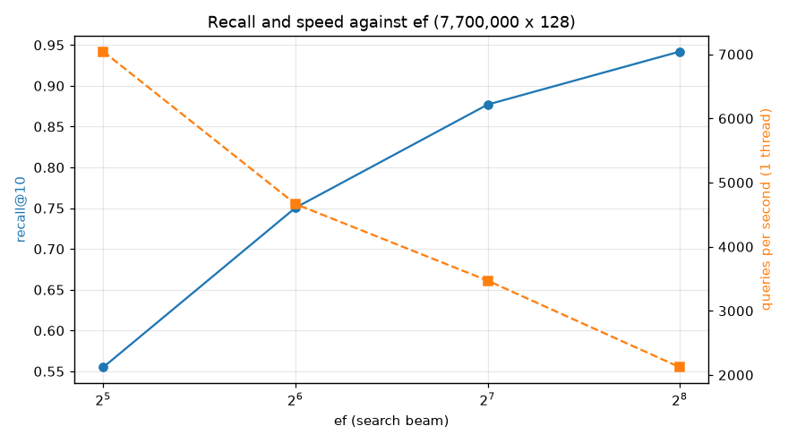
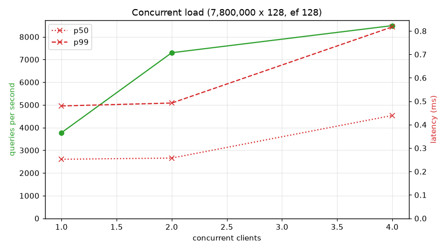
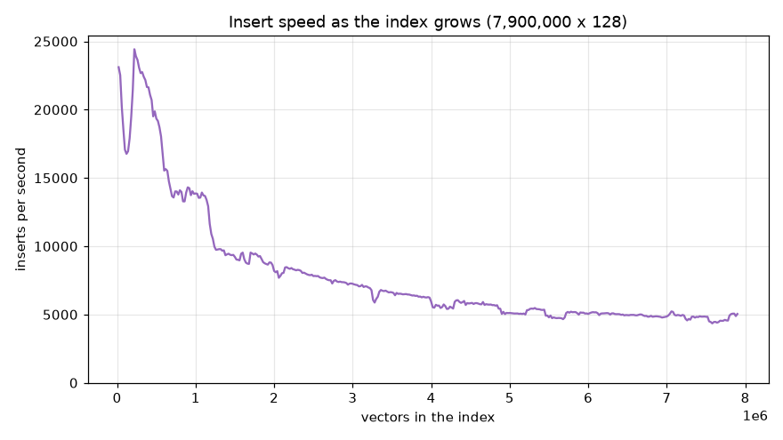
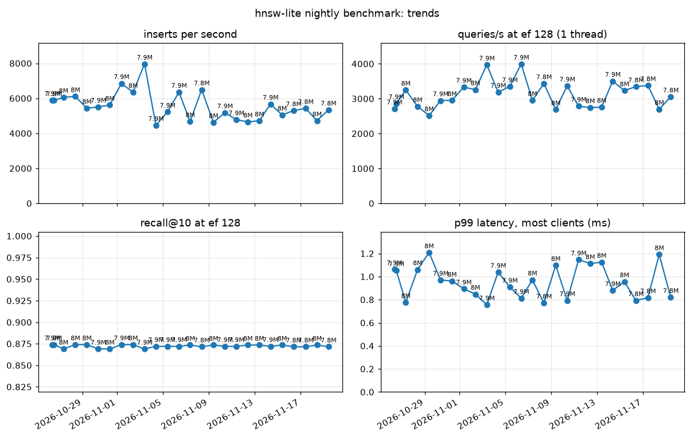

# hnsw-lite benchmarks

Published by the nightly workflow (`.github/workflows/benchmark.yml`) from `bench/python/stress.py`. Every run is kept in `runs/`; this page shows the newest and the trends.

Comparisons on real datasets (SIFT1M, GloVe) against hnswlib, FAISS and USearch: [real-datasets](real-datasets/README.md).

## Latest: 2026-11-26 10:43 UTC, commit [`a10eec9`](https://github.com/praknig/hnsw_lite/commit/a10eec96aa789f9c5c446efc1a56cefeb8f5c91b)

**7,800,000 vectors of 128 dimensions**, M 16, ef_construction 200; 4 cores; Python 3.12.16. **17 of 17 checks passed** ([run](https://github.com/praknig/hnsw_lite/actions/runs/45799069667)).

## Trends

Runs on different machines or of different sizes are not directly comparable (sizes are marked on the chart when they vary).

| Date (UTC) | Commit | Vectors | Inserts/s | Recall@10 (ef 128) | Queries/s (ef 128) | p99 ms | Checks |
|---|---|---|---|---|---|---|---|
| 2026-11-26 10:43 | `a10eec9` | 7,800,000 | 5,252 | 0.872 | 3,028 | 0.85 | 17/17 |
| 2026-11-25 11:15 | `a10eec9` | 8,000,000 | 4,849 | 0.873 | 2,820 | 1.09 | 17/17 |
| 2026-11-24 12:18 | `a10eec9` | 7,800,000 | 5,391 | 0.872 | 3,272 | 0.88 | 17/17 |
| 2026-11-23 10:33 | `a10eec9` | 7,900,000 | 4,676 | 0.872 | 2,883 | 1.01 | 17/17 |
| 2026-11-22 09:31 | `a10eec9` | 7,700,000 | 5,611 | 0.877 | 3,471 | 0.78 | 17/17 |
| 2026-11-21 09:28 | `a10eec9` | 7,800,000 | 5,397 | 0.872 | 2,965 | 0.84 | 17/17 |
| 2026-11-20 09:50 | `a10eec9` | 7,900,000 | 6,491 | 0.872 | 4,316 | 0.75 | 17/17 |
| 2026-11-19 10:09 | `a10eec9` | 7,800,000 | 5,341 | 0.872 | 3,056 | 0.82 | 17/17 |
| 2026-11-18 10:02 | `a10eec9` | 8,000,000 | 4,719 | 0.873 | 2,698 | 1.19 | 17/17 |
| 2026-11-17 10:23 | `a10eec9` | 7,800,000 | 5,426 | 0.872 | 3,380 | 0.82 | 17/17 |
| 2026-11-16 09:16 | `a10eec9` | 7,800,000 | 5,300 | 0.872 | 3,346 | 0.79 | 17/17 |
| 2026-11-15 09:10 | `a10eec9` | 8,000,000 | 5,050 | 0.873 | 3,232 | 0.96 | 17/17 |
| 2026-11-14 08:47 | `c679162` | 7,900,000 | 5,675 | 0.872 | 3,506 | 0.88 | 16/17 **FAIL** |
| 2026-11-13 09:28 | `c679162` | 8,000,000 | 4,717 | 0.873 | 2,759 | 1.13 | 16/17 **FAIL** |
| 2026-11-12 09:32 | `c679162` | 8,000,000 | 4,653 | 0.873 | 2,746 | 1.11 | 16/17 **FAIL** |
| 2026-11-11 09:11 | `c679162` | 7,900,000 | 4,781 | 0.872 | 2,788 | 1.15 | 16/17 **FAIL** |
| 2026-11-10 09:28 | `c679162` | 7,900,000 | 5,182 | 0.872 | 3,368 | 0.79 | 16/17 **FAIL** |
| 2026-11-09 09:26 | `c679162` | 8,000,000 | 4,623 | 0.873 | 2,691 | 1.10 | 16/17 **FAIL** |
| 2026-11-08 08:43 | `c679162` | 7,800,000 | 6,494 | 0.872 | 3,435 | 0.77 | 16/17 **FAIL** |
| 2026-11-07 08:34 | `c679162` | 8,000,000 | 4,673 | 0.873 | 2,956 | 0.97 | 16/17 **FAIL** |
| 2026-11-06 09:10 | `c679162` | 7,900,000 | 6,356 | 0.872 | 3,996 | 0.81 | 16/17 **FAIL** |
| 2026-11-05 09:15 | `c679162` | 7,900,000 | 5,224 | 0.872 | 3,349 | 0.91 | 16/17 **FAIL** |
| 2026-11-04 08:54 | `c679162` | 7,900,000 | 4,465 | 0.872 | 3,189 | 1.04 | 16/17 **FAIL** |
| 2026-11-03 09:11 | `7f587b1` | 7,900,000 | 7,961 | 0.869 | 3,971 | 0.76 | 16/17 **FAIL** |
| 2026-11-02 09:04 | `7f587b1` | 8,000,000 | 6,347 | 0.874 | 3,260 | 0.85 | 16/17 **FAIL** |
| 2026-11-01 08:50 | `5fdfda5` | 7,900,000 | 6,853 | 0.874 | 3,333 | 0.89 | 16/17 **FAIL** |
| 2026-10-31 08:14 | `d411208` | 8,000,000 | 5,615 | 0.869 | 2,953 | 0.96 | 16/17 **FAIL** |
| 2026-10-30 08:23 | `7108dfa` | 7,900,000 | 5,510 | 0.869 | 2,948 | 0.97 | 16/17 **FAIL** |
| 2026-10-29 08:19 | `7108dfa` | 8,000,000 | 5,433 | 0.874 | 2,516 | 1.21 | 16/17 **FAIL** |
| 2026-10-28 08:11 | `9f53b0b` | 8,000,000 | 6,106 | 0.874 | 2,778 | 1.06 | 16/17 **FAIL** |
