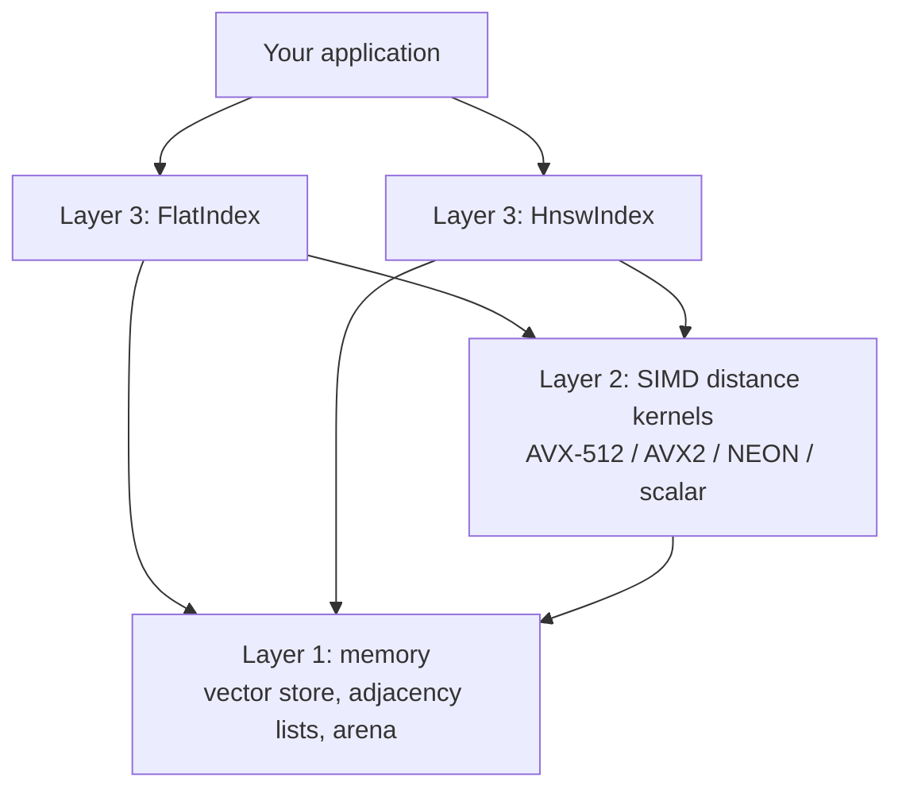
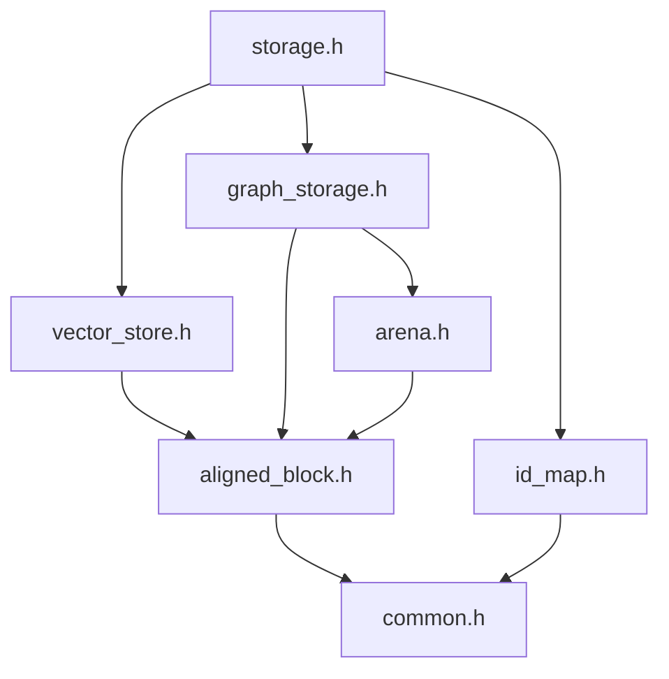
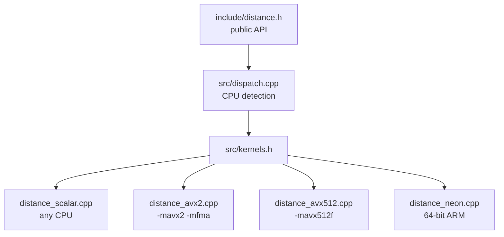
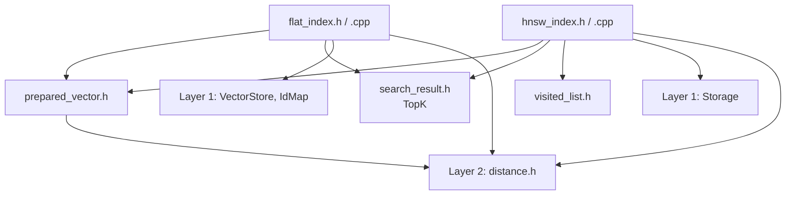

# Architecture and design

How hnsw-lite works inside: the three layers, the files, the memory layout, the SIMD distance kernels, the Flat and HNSW indexes, and the search features (metadata, filters, the query planner, batch and range search). To use the library, see the [User guide](user-guide.md) instead.

## Architecture

The engine is built as three layers. Each layer only depends on the ones below it.



| Layer | Purpose | Status |
|---|---|---|
| 1. Memory | Stores vectors and neighbor lists; finds them by arithmetic | Done |
| 2. Distance kernels | Measures how close two vectors are, using SIMD | Done |
| 3. Indexes | Flat (exact) and HNSW (approximate) search | Done |

### Layer 1 file dependencies



### Layer 2 file dependencies



### Layer 3 file dependencies



## Project structure

```
hnsw-lite/
├── .github/
│   └── workflows/
│       └── ci.yml              # GitHub Actions: build and test on every PR
├── .gitignore                  # Ignores IDE settings and build output
├── LICENSE                     # MIT License
├── CMakeLists.txt              # Builds the library, tests, benchmarks and examples
├── README.md                   # Start here: what it is and how to use it
├── docs/
│   ├── getting-started.md      # Building, build options, using it in your project
│   ├── user-guide.md           # How to use every feature
│   ├── api-reference.md        # Every public class and function
│   ├── performance.md          # Benchmarks and tuning
│   ├── architecture.md         # This file: how it works inside
│   ├── testing.md              # Tests, coverage, CI, bugs found
│   ├── project-notes.md        # Limitations, roadmap, comparison, references
│   ├── core-capabilities-plan.md       # Plan: deletion, update, persistence, concurrency
│   └── core-capabilities-test-plan.md  # Test scenarios for that plan
├── examples/                   # Small, complete programs
│   ├── example_basics.cpp      # Add, search, remove, compact
│   ├── example_filters.cpp     # Metadata, filters, predicates
│   └── example_batch_range.cpp # Batch and range search
├── include/                    # Public headers (namespace vecdb)
│   ├── common.h                # Layer 1: NodeId, kEmpty, kAlign, round_up
│   ├── aligned_block.h         # Layer 1: AlignedBlock, one aligned memory block
│   ├── arena.h                 # Layer 1: Arena, bump allocator
│   ├── vector_store.h          # Layer 1: VectorStore, aligned padded rows
│   ├── id_map.h                # Layer 1: IdMap, user ID <-> internal ID
│   ├── graph_storage.h         # Layer 1: GraphStorage, HNSW neighbor lists
│   ├── storage.h               # Layer 1: Storage, single entry point
│   ├── distance.h              # Layer 2: Metric, get_distance(), normalize()
│   ├── search_result.h         # Layer 3: SearchResult, Candidate, TopK
│   ├── prepared_vector.h       # Layer 3: PreparedVector, padded/normalized input
│   ├── visited_list.h          # Layer 3: VisitedList, VisitedListPool
│   ├── flat_index.h            # Layer 3: FlatIndex
│   ├── hnsw_index.h            # Layer 3: HnswIndex, HnswParams
│   ├── metadata.h              # Search: Value, Metadata, Schema, MetadataStore
│   ├── filter.h                # Search: Filter, CompiledFilter, SearchOptions, planner interface
│   ├── payload_index.h         # Search: ValueCounts (exact value counts)
│   └── thread_pool.h           # Search: ThreadPool, SharedPool (batch search)
├── src/                        # Compiled code (Layers 2 and 3)
│   ├── kernels.h               # Internal declarations of all kernels
│   ├── dispatch.cpp            # CPU detection, kernel selection, normalize()
│   ├── distance_scalar.cpp     # Plain loops, any CPU (reference version)
│   ├── distance_avx2.cpp       # AVX2 + FMA, 8 floats per instruction
│   ├── distance_avx512.cpp     # AVX-512F, 16 floats per instruction
│   ├── distance_neon.cpp       # NEON, 4 floats per instruction (ARM only)
│   ├── flat_index.cpp          # FlatIndex implementation
│   ├── hnsw_index.cpp          # HnswIndex implementation
│   └── query_planner.cpp       # Compiled filters and the query planner
├── tests/
│   └── test_comprehensive.cpp  # All 418 tests with a built-in runner
└── bench/
    ├── bench_distance.cpp      # Speed of every kernel version
    └── bench_search.cpp        # Flat vs. HNSW: queries/s and recall
```

Layer 1 and the Layer 3 helpers are header-only. Layer 2's kernels and Layer 3's indexes are compiled into a static library (`hnsw_lite`); the SIMD files need their own compiler flags, and the indexes contain real logic.

## Layer 1 design: memory and storage

### Goals

Every design choice in Layer 1 follows three rules:

1. **Find anything by arithmetic.** Converting a vector's number to its memory address is a calculation, never a search.
2. **Never move data.** Once something is stored, its address stays the same, so views (`std::span`) and pointers stay valid.
3. **Match the hardware.** The processor reads memory in 64-byte cache lines, so data is aligned to and packed into whole cache lines.

### Internal IDs

Users identify vectors with their own 64-bit IDs. Internally, each vector gets a dense `NodeId` (a 32-bit unsigned integer) in insertion order: 0, 1, 2, and so on. The same `NodeId` is used as an index into every array: vector rows, neighbor lists, levels and deletion flags. 32-bit IDs also halve the size of neighbor lists compared to 64-bit IDs or pointers.

### Alignment and padding

Each vector row is padded with zeros to a multiple of 16 floats (64 bytes):

| Dimension | Stored size (stride) | Padding |
|---|---|---|
| 100 | 112 floats | 12 zeros |
| 128 | 128 floats | none |
| 384 | 384 floats | none |
| 768 | 768 floats | none |
| 1536 | 1536 floats | none |

Because every memory block starts on a 64-byte boundary and every row is a whole number of cache lines, every row starts on a cache-line boundary. This avoids loads that span two cache lines, and lets the SIMD kernels process whole rows with no leftover elements. Padding is always zero, so it never changes distance results.

### Chunked storage

Rows are stored in fixed-size blocks of `2^shelf_bits` rows. By default a block holds up to 65,536 rows but at most 8 MB (for example, 16,384 rows at 128 dimensions and 1,024 rows at 1,536 dimensions), so small indexes of long vectors stay small. New blocks are added when needed; existing blocks never move or grow. Finding vector `N`:

```
block   = N >> shelf_bits
row     = N & (2^shelf_bits - 1)
address = block_start + row * stride
```

Neighbor lists on level 0 use the same scheme.

### Arena allocator

Variable-size data (upper-level neighbor lists) comes from a bump allocator. It requests large blocks (1 MB by default) and hands out pieces by advancing a counter. Individual pieces are never freed; everything is freed when the arena is destroyed. This avoids one heap allocation per node and keeps related data close together in memory. Only trivially copyable, trivially destructible types may be stored, which is checked at compile time.

### Graph storage

- **Level 0:** every node has `M0 = 2 * M` slots. With `M = 16`, that is 32 slots × 4 bytes = 128 bytes, exactly two cache lines.
- **Levels 1 and up:** a node at level `L` gets one arena allocation of `L * M` slots. Only about `1 / M` of nodes reach level 1, so most nodes use no extra memory.
- **Empty slots** hold `kEmpty` (the maximum `NodeId`). A list's length is the position of the first `kEmpty`. New level-0 blocks are filled with byte `0xFF`, which makes every slot `kEmpty` with no extra work.

### Memory budget

Approximate memory for 1 million vectors with 768 dimensions and `M = 16`:

| Component | Memory |
|---|---|
| Vectors (768 floats × 4 bytes) | ~3.07 GB |
| Level-0 neighbor lists (128 bytes each) | ~128 MB |
| Upper-level neighbor lists | ~4 MB |
| Levels, deletion flags, ID list | ~10 MB |
| User ID hash map | tens of MB |

The graph is about 4% of the vector data, so it can afford fixed-size slots in exchange for speed.

## Layer 2 design: distance kernels

A single HNSW search computes thousands of distances, and a Flat search computes one per stored vector. Nearly all search time is spent in these kernels.

### Metrics

Every distance follows one rule: **a smaller value means closer**. This keeps the search code independent of the metric.

| Metric | Returns | Notes |
|---|---|---|
| `L2` | Σ (aᵢ − bᵢ)² | No square root: the ranking is the same and it saves work |
| `InnerProduct` | −(a · b) | Negated so that a larger dot product gives a smaller distance |
| `Cosine` | 1 − (a · b) | Vectors must be normalized first with `normalize()` |

Cosine normally needs both vectors' lengths on every call. Instead, vectors are scaled to length 1 once, before they are stored, which turns cosine into a plain dot product. Only two real kernels (L2 and dot product) are therefore needed per instruction set.

### SIMD versions

| Version | Floats per instruction | Main loop | Available on |
|---|---|---|---|
| Scalar | 1 | 1 per step | Every CPU |
| NEON | 4 | 16 per step | 64-bit ARM |
| AVX2 + FMA | 8 | 32 per step | Most x86 CPUs since about 2013 |
| AVX-512F | 16 | 64 per step | Newer Intel server CPUs, AMD Zen 4 and later |

Each SIMD kernel works in three stages:

1. **Main loop** with **4 independent running sums**. A single running sum forces every addition to wait for the previous one; four sums let the CPU work on four additions at once. FMA (fused multiply-add) does each multiply and add in one instruction.
2. **Leftover loop**, one register at a time, for lengths that are not a multiple of the main-loop size.
3. **Final reduction**: the running sums are combined and the values inside the register are added into one number.

Because Layer 1 pads every row to a multiple of 16 floats, no kernel ever needs a scalar tail loop. Kernels use unaligned load instructions, which are as fast as aligned loads on aligned data and never crash on unaligned input.

### Runtime dispatch

All versions are built into one binary, and the fastest usable one is chosen when the program first asks for a kernel:

1. **Compile time:** CMake adds the AVX2 and AVX-512 files only on x86-64, each compiled with only its own flags, and defines `HNSW_LITE_HAVE_AVX2` / `HNSW_LITE_HAVE_AVX512`. On 64-bit ARM it defines `HNSW_LITE_HAVE_NEON`. The NEON file is part of every build but compiles to nothing on x86.
2. **Run time (x86):** `cpuid` reports which instruction sets the CPU supports, and `xgetbv` reports whether the operating system saves the wide registers. Both must agree: a CPU can support AVX-512 while the OS has it disabled.
3. **Choice:** AVX-512, then AVX2, then NEON, then scalar. The result is cached in function-local statics, which C++ initializes exactly once, even with several threads.

### Safety rule for SIMD files

`src/kernels.h` contains declarations only, and kernel files include as little as possible. If a file compiled with `-mavx2` included a header with inline functions, the compiler could build those functions with AVX2 instructions, and the linker could then use that copy everywhere, crashing on CPUs without AVX2.

### Input rules

Every `DistanceFn` expects:

- `n` to be a multiple of 16 (pass `VectorStore::stride()`, not `dim()`);
- values beyond the real dimension to be zero (`VectorStore` guarantees this).

Vectors from users are not padded, so Layer 3's `PreparedVector` copies each query (and each new vector) into a padded, aligned buffer first.

## Layer 3 design: indexes

Layer 3 decides **which** vectors to compare and in what order. It never manages memory (Layer 1) or computes distances itself (Layer 2).

### Components

| Component | Responsibility | Uses from Layer 1 | Uses from Layer 2 |
|---|---|---|---|
| `PreparedVector` | Copies a user vector into a padded, aligned buffer; normalizes it for cosine | `AlignedBlock`, `round_up` | `normalize`, `Metric` |
| `TopK`, `Candidate`, `SearchResult` | Keeps the k best candidates in a bounded max-heap | `NodeId` | none |
| `VisitedList`, `VisitedListPool` | Marks visited nodes in O(1); reuses lists across searches | `NodeId` | none |
| `FlatIndex` | Exact search over every vector | `VectorStore`, `IdMap` | `get_distance`, `DistanceFn` |
| `HnswIndex` | Approximate search over a multi-level graph | `Storage` (all three parts), `kEmpty` | `get_distance`, `DistanceFn` |

`FlatIndex` uses `VectorStore` and `IdMap` directly instead of `Storage`, so it does not pay for 128 bytes of unused neighbor slots per vector. `HnswIndex` uses `Storage`, whose `insert(id, vector, level)` keeps a vector, its neighbor lists and its user ID under the same number.

Only one change was needed in the lower layers: `GraphStorage::set_links`, which replaces a node's neighbor list and clears the leftover slots.

### Shared rules

- **Internal numbers inside, user IDs at the edges.** Every loop works with `NodeId`s, which index Layer 1's arrays directly. User IDs are translated only when an add or remove arrives and when results are returned.
- **Kernel chosen once.** Each index stores its `DistanceFn` when it is created, so search loops make direct calls.
- **One preparation path.** Inserts and queries both go through `PreparedVector`, so cosine normalization cannot be forgotten in one of them.
- **Real deletion.** Flat moves its last vector into the removed vector's slot (swap-with-last). HNSW optionally repairs the removed vector's neighbors, frees its ID, and puts its slot on a free list that the next insert reuses (last in, first out). Removing the entry point picks a new live one; removing everything leaves the entry point `kEmpty`, as in a new index. Links left pointing at a reused slot from a level the node no longer reaches ("stale" links) are skipped by searches and dropped by inserts and repairs.
- **Errors leave the index unchanged.** A wrong dimension, a NaN or infinite value, or a duplicate ID throws `std::invalid_argument` before anything is modified (and, in HNSW, before a random level is drawn, so later inserts build exactly the same graph). A removed ID can be added again.
- **Only finite values.** `PreparedVector` rejects NaN and infinity, because one such value would corrupt every distance computed against that vector. Layer 1 itself stores any float.
- **Inserts survive running out of memory.** `IdMap`, `VectorStore`, `GraphStorage`, `Storage` and `FlatIndex` inserts are all-or-nothing: they grow their containers before changing anything, and `Storage` undoes earlier steps if a later one fails. An HNSW insert that fails while linking marks its half-linked vector as removed, so the index stays consistent; that vector's ID stays taken.
- **NaN distances sort last.** Inputs are finite, but an inner product of huge values can still overflow to NaN; `ordered_distance` turns it into +∞.
- **Oversized requests are capped.** A `k` larger than the index returns everything; HNSW's `ef` is raised to at least `k` and capped at the number of nodes.

### FlatIndex

- **add:** prepare the vector, register the ID in `IdMap`, store the values in `VectorStore`.
- **search:** prepare the query; for every vector, skip it if removed, otherwise compute the distance and offer it to a `TopK` of size k; return the sorted results with user IDs.

Cost: one distance per stored vector. Exact, with equal distances ordered by insertion.

### HnswIndex

**Structure.** Every vector is a node on level 0 with up to `2M` links. A node's top level is drawn at random as `floor(-ln(u) / ln(M))`, so about 1 in M nodes reach level 1, 1 in M² reach level 2, and so on. The entry point is a node on the highest level. The random numbers are converted to doubles by hand rather than with `std::uniform_real_distribution`, so graphs are identical across compilers.

**Search** (`search(query, k, ef)`):

1. Prepare the query. Raise `ef` to at least `k`.
2. **Greedy descent:** from the entry point, on each level from the top down to 1, keep moving to any neighbor that is closer to the query.
3. **Beam search on level 0:** a min-heap of candidates to expand and a `TopK` of the best `ef` results. Repeatedly expand the closest candidate; stop when it is farther than the worst result. A borrowed `VisitedList` prevents checking a node twice.
4. Return the best k, skipping removed nodes, with user IDs.

**Insert** (`add(id, vector)`):

1. Validate and prepare the vector; reject duplicates before drawing a random level.
2. Draw the level and store everything with `Storage::insert`. The first node becomes the entry point.
3. Greedy descent from the entry point down to the level just above the new node's level.
4. On each level from the new node's level (or the current top, if lower) down to 0: beam search with `ef_construction`, choose up to M neighbors with the heuristic, and link both ways. The best nodes found become the starting points for the next level. Removed nodes are traveled through but not chosen as neighbors, so new nodes do not waste link slots on them; only if every nearby node is removed does the new node link to them, so it can never end up unreachable.
5. If the new node is higher than every other node, it becomes the entry point.

**Neighbor heuristic.** Candidates are considered closest first; one is kept only if it is closer to the base node than to every neighbor already kept. This keeps links pointing in different directions instead of into one cluster, which keeps the graph navigable. When a neighbor's list is full, the heuristic re-selects that list from its old links plus the new node. These choices match hnswlib.

One addition beyond hnswlib: a candidate that is a **bit-identical copy** of an already-kept neighbor is skipped. Identical vectors are all at distance 0 from each other, a tie, so the plain rule keeps every copy, and lists near a cluster of duplicates fill up with copies of one point. In testing with 200 identical vectors among 200 random ones, this cut links to the rest of the graph and made 44 of the random vectors unreachable; with the copy check, every random vector stays reachable. The check uses `memcmp`, which stops at the first differing byte, so it costs almost nothing, and on data without duplicates the graph is unchanged.

**Threading.** One writer at a time, with no searches running. Several searches may run at once when no writer is active; each borrows its own `VisitedList` from a mutex-protected pool, and returns it automatically through an RAII handle.

## Search features design

### Metadata

Each vector can carry fields of five types: integer (`int64`), float (`double`, finite only), boolean, keyword (string) and tag set (strings). Metadata is attached with a small builder:

```cpp
index.add(id, vector, Metadata().set("category", "news").set("year", 2024)
                                .set("in_stock", true).set_tags("tags", {"ai", "chips"}));
```

**Schemas.** Each index chooses its schema mode:

| Mode | Unknown field at insert | Unknown field in a filter |
|---|---|---|
| `Schema::strict({...})` | Rejected | Error (catches typos) |
| `Schema::dynamic({...})` (default) | Created, with the type of its first value | Matches nothing (the field may not exist yet) |

In both modes a field keeps one type; a value of another type is rejected (an integer is accepted for a float field). Invalid metadata throws `std::invalid_argument` and changes nothing; a failed insert never leaves a newly created field behind.

**Storage.** `MetadataStore` keeps one column per field, indexed by slot like vectors and links: `int64`, `double`, a byte per boolean, a 4-byte dictionary ID per keyword, a list of dictionary IDs per tag set, plus a "has a value" byte. Strings are stored once in a dictionary, so keyword and tag comparisons are integer comparisons. Columns grow only to the highest slot written. Metadata follows its vector through every slot operation: Flat's swap-with-last moves the row, HNSW slot reuse overwrites it, removal clears it, `compact()` copies it. Writes are all-or-nothing: fields and strings are created and columns grown before anything visible changes.

### Filters

```cpp
Filter::eq("category", "news") && (Filter::ge("year", 2020) || Filter::has_tag("tags", "ai"))
```

Available conditions: `eq`, `ne`, `lt`, `le`, `gt`, `ge`, `between` (inclusive), `in`, `has_tag`, `has_any_tag`, `has_all_tags`, `exists`, combined with `&&`, `||` and `!`.

**Rules:**
- **Missing fields:** comparisons never match a vector without the field, including `ne` (as in SQL). `!` negates the whole condition, so `!Filter::eq("category", "news")` does match vectors without a category. `exists` tests presence.
- **Numbers:** integers and floats compare exactly with each other, even beyond the precision of a double.
- Keywords support `eq`, `ne`, `in`; booleans `eq`, `ne`, `in`; tag sets the `has_*` conditions. `between` with low above high, and an empty `in` list, match nothing. NaN values are rejected.

Filters are checked against each index's schema when used (type errors throw `std::invalid_argument`) and compiled to a flat form: field names become column numbers, strings become dictionary IDs. A compiled filter evaluates a slot with a few column reads and no memory allocation.

**Custom predicates.** `SearchOptions::predicate` accepts any `bool(user_id)` function, for conditions that live outside the index, such as permissions. Combined with a filter, both must pass, with the filter checked first. In batch search a predicate may be called from several threads at once, so it must be safe to call concurrently.

### The query planner

A filtered HNSW search can either scan the matching vectors exactly, or search the graph while treating non-matching vectors like removed ones (traveled through, never returned). The planner chooses per query:

1. **Estimate the number of matches:** exactly from the payload index when the filter allows it (and there is no predicate), exactly by checking every slot when the index is smaller than the sample size, otherwise from a deterministic sample of 256 live vectors.
2. **Choose:** exact search if the expected matches are at most `max_exact_matches` (default 2,000) **or** their fraction is at most `max_exact_fraction` (default 1%); otherwise graph search, with `ef` widened by 1 / selectivity, up to `max_ef_multiplier` (32) times.

Settings live in `PlannerParams`, per index (`set_planner_params`) or per query (`SearchOptions::planner`). `Strategy::ForceExact` and `Strategy::ForceGraph` override the choice. `SearchStats` reports the strategy, the reason, the estimate, the beam width, and the work done. On very large indexes lower `max_exact_fraction`: 1% of 100 million vectors is a million exact distance computations.

**Payload index.** `create_payload_index(field)` keeps exact per-value counts for a keyword, boolean or tag-set field, which the planner uses instead of sampling. This first version keeps counts only; posting lists (letting exact search read only the matching vectors) are a later step.

### Batch search

`search_batch(queries, k, ...)` takes the queries back to back in one buffer and returns one result list per query. Every query is validated before any work. HNSW spreads queries over a reusable thread pool. Flat uses **tiling**: a block of 256 stored vectors is compared with a chunk of 16 queries, so each vector loaded into the cache serves 16 queries instead of one. Results are identical to separate `search` calls, whatever the thread count.

### Range search

`search_range(query, radius, max_results)` returns every eligible vector with distance at or below `radius`, closest first. The radius uses each metric's "smaller is closer" distance, so **for L2 it is a squared distance**; `l2_radius(r)` converts an ordinary radius. `max_results` is optional (no limit by default; 0 returns nothing).

Flat scans exactly. HNSW **grows a region**: a normal search, started from both the greedy descent and the entry point, finds the nearest vectors, then every vector inside the radius has its neighbors visited, continuing outward. `SearchOptions::range_expand_outside` (default 1) lets the growth cross that many vectors outside the radius, so a narrow gap does not cut a region in two. It is approximate; `Strategy::ForceExact` scans instead.